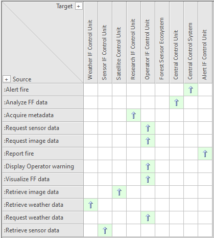

# SLV08a Logical Functional Mapping VP

## Purpose
The Logical Functional Mapping Viewpoint supports the definition of assignment of system functions and system partial functions to conceptual logical system elements.

## Example

## Workflow
**Viewpoint Input:**
* SAF_FunctionAction from [SFV03a](System-Process-Viewpoint.md) and [SFV03c](System-Functional-Refinement-Viewpoint.md)
* SAF_LogicalContextRole from [SFV01b](System-Definition-Viewpoint.md)
* SAF_LogicalInternalRole from [SLV02a](Logical-Structure-Definition-Viewpoint.md)

**Step-by-Step Guide:**
1.  Create an Logical Functional Mapping diagram as specialized [SysML 1.5 Block Definition Diagram](https://sparxsystems.com/enterprise_architect_user_guide/16.1/modeling_languages/block_definition_diagrams.html) with Add Diagram > SAF > BlockDefinition > SAF::SLV08a_LogicalFunctionalMappingView.
2.	Create (and maintain) a matrix specification to allocate Function Actions to Logical Context Roles.
3.	Create (and maintain) another matrix specification to allocate Function Actions to Logical Internal Roles.
4.	Use the SAF standard search for the current mapping report by pressing Ctrl+F > SAF > SLV08a_LogicalFunctionalMapping_Context and/or SLV08a_LogicalFunctionalMapping_Internal.

**Viewpoint Output:**
* External: Traceability supports the quality control of the model, showing “lose ends” or inconsistencies. Also, it supports impact analyses for change management and assessments.

## Exposed Elements and Connectors
The following Stereotypes / Model Elements are used in the Viewpoint:
* Allocate [SysML Profile]
* [SAF_LogicalInternalRole](https://saf.gfse.org/userdoc/stereotypes.html#saf_logicalinternalrole)
* [SAF_FunctionAction](https://saf.gfse.org/userdoc/stereotypes.html#saf_functionaction)
* [SAF_LogicalElement](https://saf.gfse.org/userdoc/stereotypes.html#saf_logicalelement)
* [SAF_LogicalSOI](https://saf.gfse.org/userdoc/stereotypes.html#saf_logicalsoi)
* [SAF_SLV08a_View - new Doc with renamed stereotype](https://saf.gfse.org/userdoc/stereotypes.html#saf_l8_lfum_matrix)
* [SAF_SystemFunction](https://saf.gfse.org/userdoc/stereotypes.html#saf_systemfunction)
* [SAF_SystemPartialFunction](https://saf.gfse.org/userdoc/stereotypes.html#saf_systempartialfunction)

## General Recommendations and Pitfalls
* The tool Enterprise Architect does not automatically allocate Function Actions to Logical Internal/Context Roles when they are put into a partitions. Therefore, any allocation of a Function Action to a Logical Role has to be maintained manually. It is recommended to link this viewpoint in any affected diagram, to be able to maintain the allocation matrix quickly and easily when working in Process Viewpoints.

[>>> back to cheat sheet overview](../CheatSheet.md)
