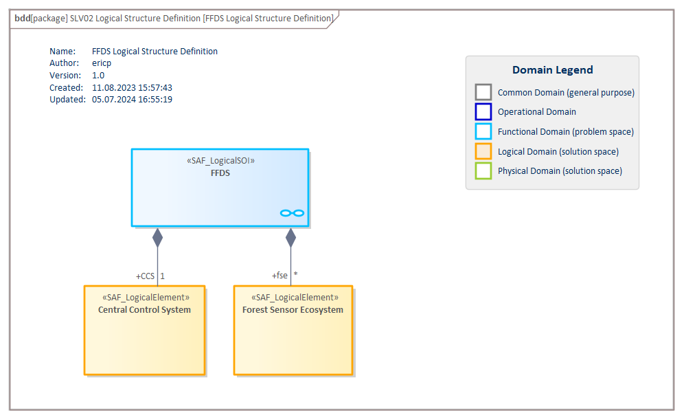

# SLV02a Logical Structure Definition VP

## Purpose
The Logical Structure Viewpoint describes how the system is decomposed into a hierarchical structure of logical elements responsible for different system functions (divide & conquer principle). It covers related logical concepts and principles that support the logical operation of the system and is widely reusable among similar systems like product families, or product generations.

## Example

## Workflow
**Viewpoint Input:**
* the SAF_LogicalSOI from [SFV01b](System-Context-Definition-Viewpoint.md)

**Step-by-Step Guide:**
1.  Create a new Logical Structure Definition diagram as specialized SysML1.5 Block Definition Diagram (https://sparxsystems.com/enterprise_architect_user_guide/16.1/modeling_languages/block_definition_diagrams.html) in the dedicated package in your model with Add Diagram > SAF > BlockDefinition > SAF::SLV02a_LogicalStructureView.
2. Drag and drop your Logical SOI to the diagram.
3. Create Logical Elements which represent parts of your system.
4. Create Logical Internal Roles by using the composition relationship. Give the Logical Internal Role a meaningful name by selecting the part property in the Logical SOI and amending the name on the property element page for traceability purposes in matrix specifications.
5. If needed, define the multiplicity for the Logical Internal Roles.

**Viewpoint Output:**
* SAF_LogicalInternalRoles which are used in [SLV04a](Logical-Internal-Interaction-Viewpoint.md) and [SLV04b](Logical-Internal-Exchange-Viewpoint.md)
* SAF_FunctionActions are allocated to SAF_LogicalInternalRoles in [SLV08a](Logical-Functional-Mapping-Viewpoint.md)
* SAF_LogicalInternalRoles are allocated to SAF_PhysicalInternalRoles in [SPV08a](Physical-Logical-Mapping-Viewpoint.md)

## Exposed Elements and Connectors
The following Stereotypes / Model Elements are used in the Viewpoint:
* [SAF_LogicalInternalRole](https://github.com/GfSE/SAF-Specification/blob/TdSE2023/stereotypes.md#SAF_LogicalInternalRole) contained in SAF_LogicalElement
* [SAF_LogicalElement](https://github.com/GfSE/SAF-Specification/blob/TdSE2023/stereotypes.md#SAF_LogicalElement)
* [SAF_LogicalSOI](https://github.com/GfSE/SAF-Specification/blob/TdSE2023/stereotypes.md#SAF_LogicalSOI)

## General Recommendations and Pitfalls
* Name the properties as for traceability management in Enterprise Architect the matrix specification displays the element name only. 
* The logical structure of the SOI represents the conceptual breakdown following a devide and conquer principle. The main drivers for the breakdown structure are organizational structure (organizational units such as supplier responsibilities), safety & security (separate critical from non-critical parts) and the functional breakdown [SFV02c](System-Functional-Breakdown-Viewpoint.md). 
* It is stronlgy recommended to identify organizational responsibility borders, which should be addressed by at least on Interface Definition.
* The logical structure of the SOI should define less technology as possible. This is scope of [SPV02a](Physical-Structure-Definition-Viewpoint.md).
* Please note that the breakdown might consist of appropriate structural elements, but also additional elements for structural arrangement purposes only ("Auxillary"). These elements (without a life-cycle) represent only a collection of appropriate structural elements. It is recommended to mark the elements (e.g. with tagged value). 

[>>> back to cheat sheet overview](../CheatSheet.md)
