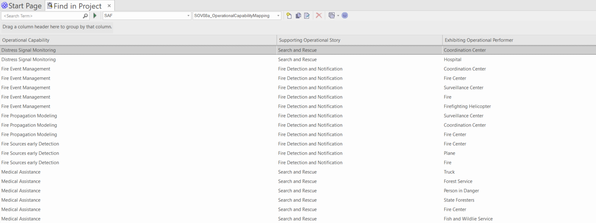

# SOV08a Operational Capability Mapping VP

## Purpose
The Operational Capability Mapping Viewpoint describes the relationships of Operational Capabilities. The reasoning for Operational Capabilities as support for Operational Stories and the contribution of Operational Processes to Capabilities are described. Operational Capabilities encoded in Stakeholder Requirements are identified.

## Example

## Workflow
Viewpoint Input:
* SAF_OperationalCapability from SOV02c for traceability purposes.
* SAF_OperationalPerformer from SOV02b for traceability purposes.
* SAF_OperationalStory from SOV01a for traceability purposes.

Step-by-Step Guide:
1.	Create an Operational Capability Traceability diagram as specialized SysML 1.5 Block Definition Diagram with Add Diagram > SAF > BlockDefinition > SAF::SOV08b_OperationalCapabilityTraceabilityView.
2.	Create (and maintain) a matrix specification to link Operational Capabilities to Operational Stories with the following configuration using the Operational Capability Support stereotype. 
3.	Create (and maintain) a matrix specification to link Operational Performer to Operational Capabilities with the following configuration using the Operational Performer Exhibit stereotype.
4.	Use the SAF standard search for the current traceability/mapping report by pressing Ctrl+F > SAF > SOV08a_OperationalCapabilityMapping.
Viewpoint Output:
* External: Traceability supports the quality control of the model, showing “lose ends” or inconsistencies. Also, it supports impact analyses for change management and assessments.

## Exposed Elements and Connectors
The following Stereotypes / Model Elements are used in the Viewpoint:
* [SAF_OperationalCapability](https://github.com/GfSE/SAF-Specification/blob/TdSE2023/stereotypes.md#SAF_OperationalCapability)

* [SAF_OperationalCapabilityComposition](https://github.com/GfSE/SAF-Specification/blob/TdSE2023/stereotypes.md#SAF_OperationalCapabilityComposition)
* [SAF_OperationalCapabilityDependency](https://github.com/GfSE/SAF-Specification/blob/TdSE2023/stereotypes.md#SAF_OperationalCapabilityDependency)
* [SAF_OperationalCapabilityGeneralization](https://github.com/GfSE/SAF-Specification/blob/TdSE2023/stereotypes.md#SAF_OperationalCapabilityGeneralization)
* [SAF_OperationalCapabilitySupport](https://github.com/GfSE/SAF-Specification/blob/TdSE2023/stereotypes.md#SAF_OperationalCapabilitySupport)
* [SAF_OperationalPerformerExhibit](https://github.com/GfSE/SAF-Specification/blob/TdSE2023/stereotypes.md#SAF_OperationalPerformerExhibit)
* [SAF_OperationalPerformer](https://github.com/GfSE/SAF-Specification/blob/TdSE2023/stereotypes.md#SAF_OperationalPerformer)
* [SAF_OperationalProcessEnabling](https://github.com/GfSE/SAF-Specification/blob/TdSE2023/stereotypes.md#SAF_OperationalProcessEnabling)
* [SAF_OperationalProcess](https://github.com/GfSE/SAF-Specification/blob/TdSE2023/stereotypes.md#SAF_OperationalProcess)
* [SAF_OperationalStory](https://github.com/GfSE/SAF-Specification/blob/TdSE2023/stereotypes.md##SAF_OperationalStory)
* [SAF_StakeholderRequirement](https://github.com/GfSE/SAF-Specification/blob/TdSE2023/stereotypes.md#SAF_StakeholderRequirement)
* [SAF_StakeholderRequirementRefinement](https://github.com/GfSE/SAF-Specification/blob/TdSE2023/stereotypes.md#SAF_StakeholderRequirementRefinement)

## General Recommendations and Pitfalls
* There is not automatic tool support to ensure that the sum of all Operational Capabilities linked to one Operational Story fully cover this story. Thorough reviews are required to ensure this coverage.
* If the Viewpoint SAF SOV02c Operational Capability is not utilized in a project, then no dependency matrix between Operational Capabilities and Operational Stories has to be established.
* The traceability between Operational Capabilities and Operational Performer is not an allocation. Thus, it is not required to decompose an Operational Capabilities to map the sub-capability to an Operational Performer.
