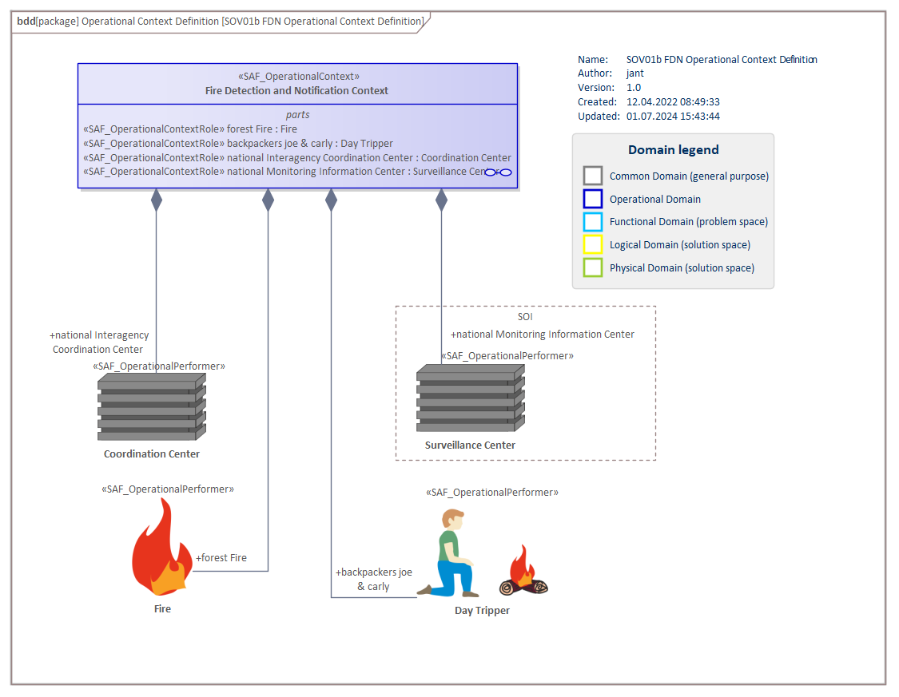

# SOV01b Operational Context Definition VP

## Purpose
The Operational Context Definition Viewpoint provides the operational contexts and the involved operational performers necessary to support a specific set of operational capabilities.

## Example

## Workflow
**Viewpoint Input:**
* Defined SAF_OperationalPerformer from [SOV02b](Operational-Performer-Viewpoint.md).

**Step-by-Step Guide:**
1.	Create a new Operational Context Definition diagram as specialized [SysML1.5 Block Definition Diagram](https://sparxsystems.com/enterprise_architect_user_guide/16.1/modeling_languages/block_definition_diagrams.html) in the dedicated package in your model with Add Diagram > SAF > BlockDefinition > SAF::SOV01b_OperationalContextDefinitionView.
2.	Add an Operational Context element to the diagram.
3.	Drag and drop already available Operational Performer or create new Operational Performer in the diagram. New created Operational Performer must be moved to the dedicated package.
4.	Create Operational Roles by using the composition relationship. Please note that the composition must be set from the Operational Context to the Operational Performer.
5.	Give the Operational Role a meaningful name by selecting the part property in the Operational Context and amending the name on the property element page for traceability purposes in matrix specifications.

**Viewpoint Output:**
* Operational Roles are used for exchange [SOV01c](Operational-Context-Exchange-Viewpoint.md), Operational Processes [SOV03a](Operational-Process-Viewpoint.md) and Operational Interactions [SOV04a](Operational-Interaction-Viewpoint.md).

## Exposed Elements and Connectors
The following Stereotypes / Model Elements are used in the Viewpoint:
* [SAF_OperationalContextRole](https://github.com/GfSE/SAF-Specification/blob/TdSE2023/stereotypes.md#SAF_OperationalContextRole)
* [SAF_OperationalContext](https://github.com/GfSE/SAF-Specification/blob/TdSE2023/stereotypes.md#SAF_OperationalContext)
* [SAF_OperationalPerformer](https://github.com/GfSE/SAF-Specification/blob/TdSE2023/stereotypes.md#SAF_OperationalPerformer)

## General Recommendations and Pitfalls
* At least one Operational Context is required in model for the Operational Domain. It is possible however, to create several Operational Contexts with different scopes.
* Different Operational Contexts should be defined if the scopes of these differ largely. This could be e.g., due to operational ambiguities between different Operational Stories or different operational scopes (e.g., different life phases).
* While it is possible to create Operational Performer(s) in this viewpoint, it is recommended to manage and maintain them in the SAF SOV02b Operational Performer Viewpoint.
