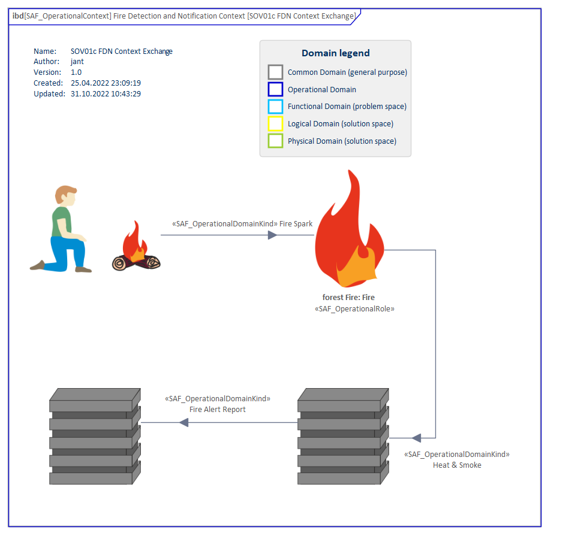

# SOV01c Operational Context Exchange VP

## Purpose
The Operational Context Exchange Viewpoint provides the operational exchange of systems, personnel, information, material, energy, etc. between operational performers.

## Example

## Workflow
Viewpoint Input:
* SAF_OperationalRole from SOV01b.
* SAF_OperationalDomainKind from SOV02a as exchange items between the different Operational Roles within one or more Operational Context(s). 

Step-by-Step Guide:
1.	Select an Operation Context and add a new Operational Context Exchange Diagram as a specialized SysML1.5 Internal Block Diagram with Add Diagram > SAF > InternalBlock > SAF::SOV01c_OperationalContextExchangeView.
2. 	Drag and drop the involved Operational Roles from the Operational Context onto the Operational Context Exchange Diagram.
3.	If the Operational Role exchange information, energy, or material establish an Item Flow and select the according Operational Domain Kind.
4.	Create a Connector between the Operational Roles.
5.	Select the Connector > right-click on the Connector > Advanced > Information Flow Realized > Select the available Operational Domain Kind(s). 

Viewpoint Output:
* Communication / interaction between Operational Roles in SOV03a and SOV04a.

## Exposed Elements and Connectors
The following Stereotypes / Model Elements are used in the Viewpoint:
* Connector
* ItemFlow
* [SAF_OperationalContextRole](https://github.com/GfSE/SAF-Specification/blob/TdSE2023/stereotypes.md#SAF_OperationalContextRole)
* [SAF_OperationalContext](https://github.com/GfSE/SAF-Specification/blob/TdSE2023/stereotypes.md#SAF_OperationalContext)
* [SAF_OperationalDomainKind](https://github.com/GfSE/SAF-Specification/blob/TdSE2023/stereotypes.md#SAF_OperationalDomainKind)

## General Recommendations and Pitfalls
*	It is recommended to agree on which details are exposed on one diagram: only essentials, all known exchanges, intended exchanges and/or unwanted disturbances.
*	It is possible to create several Operational Context Exchange views for one Operational Context. This can be helpful to focus the Operational Context Exchange Viewpoint on specific issues or situations within the Operational Context.
*	The Exchanges should incorporate everything that is actually exchanged between Operational Performers within the given Operational Context and the scope of the Operational Context Exchange Viewpoint. If the Viewpoint gets too confusing, it can help to color code different types of exchange Item Flows (e.g. material flow, energy flow, information flow).
*	When there is a specific Operational Domain Kind missing to type an exchange, it should be created in SAF SOV02a Operational Domain Item Kind Viewpoint before being used in this viewpoint.
