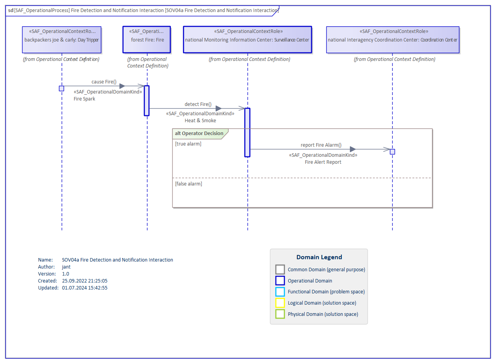

# SOV04a Operational Interaction VP

## Purpose
The Operational Interaction Viewpoint describes single threads of interaction between Operational Performers in an Operational Context on an operational domain level. Note: The Operational Interaction Viewpoint may refine an Operational Story.

## Example

## Workflow
**Viewpoint Input:**
* Operational Story from [SOV01a](Operational-Story-Viewpoint.md) which need a refinement
* Operational Roles from [SOV01b](Operational-Context-Definition-Viewpoint.md) for life-lines.
* Operational Domain Item Kinds from [SOV02a](Operational-Domain-Item-Kind-Viewpoint.md) as object flows between the life-lines.

**Step-by-Step Guide:**
1.	Create an Operational Process item in the dedicated package in your model to formalize an Operational Story or to expose a scenario.
2.	Create a new SAF Operational Interaction diagram as [SysML 1.5 sequence diagram](https://sparxsystems.com/enterprise_architect_user_guide/16.1/modeling_languages/sysml-seq-diagram.html) for the new Operational Process - right-click on the Operational Process, select New Child Diagram > Add Diagram > SAF > Sequence > SAF::SOV04a_OperationalInteractionView
3.	Drag and drop Operational Roles onto the diagram which are involved in the interaction.
4.	Define the sequence in the interaction with messages and fragments.
5.	Select the message > right-click on the Connector > Advanced > Information Flow Realized > Select the available Operational Domain Kind(s)

**Viewpoint Output:**
* Stakeholder Requirements [SOV06a](Stakeholder-Requirements-Viewpoint.md) can be elicit from the interaction

## Exposed Elements and Connectors
The following Stereotypes / Model Elements are used in the Viewpoint:
* Interaction Fragment
* Message
* Item Flow
* [SAF_OperationalContextRole](https://saf.gfse.org/userdoc/stereotypes.html#saf_operationalcontextrole)

## General Recommendations and Pitfalls
* This viewpoint is an alternative viewpoint to SAF SOV03a Operational Process Viewpoint in that it serves the same purpose to detail Operational Stories. However, it does so differently by concentrating on the interactions between Operational Performers, whereas the Operational Process shows “internal” behavior of these performers as well. It should be decided, which viewpoint to use within a project and only use the alternative when necessary.

[>>> back to cheat sheet overview](../CheatSheet.md)
