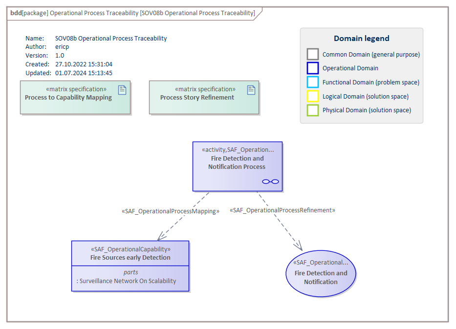

# SOV08b Operational Process Mapping VP

## Purpose
The Operational Process Mapping Viewpoint describes the relationships of Operational Processes. The reasoning for Operational Processes from Operational Stories and their contribution to Capabilities is described. The assignment of Operational Processes to Operational Performers is captured.

## Example

## Workflow
**Viewpoint Input:**
* SAF_OperationalProcess from [SOV03a](Operational-Process-Viewpoint.md) for mapping purposes.
* SAF_OperationalStory from [SOV01a](Operational-Story-Viewpoint.md) for mapping purposes.
* SAF_OperationalCapability from [SOV02c](Operational-Capability-Viewpoint.md) for mapping purposes.

**Step-by-Step Guide:**
1.	If needed, create an Operation Process Traceability diagram as specialized [SysML 1.5 Block Definition Diagram](https://sparxsystems.com/enterprise_architect_user_guide/16.1/modeling_languages/block_definition_diagrams.html) with Add Diagram > SysML 1.5 > BlockDefinition > SAF_SOV08a_OperationalProcessTraceabilityDiagram.
2.	Create (and maintain) a matrix specification to link Operational Processes to Operational Performer with the following configuration using the SysML allocation. Set the allocation link according to the involvement of the Operational Performer in Operational Processes.
3.	Create (and maintain) a matrix specification to link Operational Processes to Operational Stories with the following configuration using the Operational Process Refinement stereotype. Set the dependency links according to which Operational Process refines which Operational Story.
4.	Create (and maintain) a matrix specification to link Operational Processes to Operational Capabilities with the following configuration using the Operational Process Mapping stereotype. Set the dependency links according to which Operational Process can be mapped to Operational Capabilities
5.	Use the SAF standard search for the current traceability/mapping report by pressing Ctrl+F > SAF > SOV08b_OperationalProcessMapping. 

**Viewpoint Output:**
* External: Traceability supports the quality control of the model, showing “lose ends” or inconsistencies. Also, it supports impact analyses for change management and assessments.

## Exposed Elements and Connectors
The following Stereotypes / Model Elements are used in the Viewpoint:
* [SAF_OperationalCapability](https://github.com/GfSE/SAF-Specification/blob/TdSE2023/stereotypes.md#SAF_OperationalCapability)
* [SAF_OperationalPerformer](https://github.com/GfSE/SAF-Specification/blob/TdSE2023/stereotypes.md#SAF_OperationalPerformer)
* [SAF_OperationalProcessEnabling](https://github.com/GfSE/SAF-Specification/blob/TdSE2023/stereotypes.md#SAF_OperationalProcessEnabling)
* [SAF_OperationalProcessRefinement](https://github.com/GfSE/SAF-Specification/blob/TdSE2023/stereotypes.md#SAF_OperationalProcessRefinement)
* [SAF_OperationalProcess](https://github.com/GfSE/SAF-Specification/blob/TdSE2023/stereotypes.md#SAF_OperationalProcess)
* [SAF_OperationalStory](https://github.com/GfSE/SAF-Specification/blob/TdSE2023/stereotypes.md#SAF_OperationalStory)

## General Recommendations and Pitfalls
* There is not automatic tool support to ensure that the sum of all Operational Processes linked to one Operational Story fully cover this story. Thorough reviews are required to ensure this coverage.
* If the Viewpoint SAF SOV02c Operational Capability is not utilized in a project, then no dependency matrix between Operational Capabilities and Operational Processes has to be established.

[>>> back to cheat sheet overview](../CheatSheet.md)
