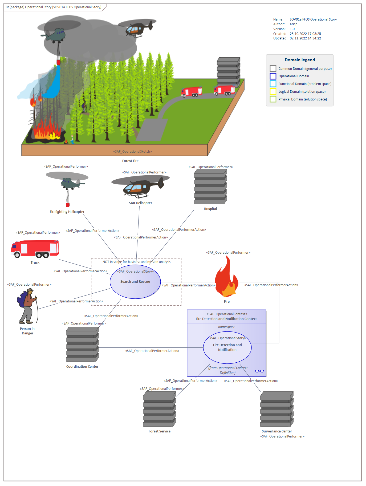

# SOV01a Operational Story VP

## Purpose
The Operational Story Viewpoint
* captures operational stories within operational contexts and their relation to operational performers, thus enables storytelling
* illustrates the operational background from the Stakeholder perspective
* serves as starting point to identify Stakeholders and/or context elements
* fosters the communication among different Stakeholders

## Example

## Workflow
**Viewpoint Input:**
* SAF_OperationalPerformer from [SOV02b](Operational-Performer-Viewpoint.md).
* Illustration - The operational story contents and the foundations for the sketches and the performer illustrations are created with the assistance of product experts

**Step-by-Step Guide:**
1.	Establish a dedicated package in your model for Operational Stories
2.	Create a SAF Operational Story Diagram as specialized [SysML1.5 Use Case Diagram](https://sparxsystems.com/enterprise_architect_user_guide/16.1/guide_books/sysml-uc-dgms.html) for your operational stories in your package with Add Diagram > SAF > UseCase > SAF::SOV01a_OperationalStoryView.
3.	Design a meaningful illustration of the operational events, performer und processes as a picture file and add the file as image asset (specialized artifact) to your model (please note that you don’t need the image asset on your diagram)
4.	Add an Operational Sketch on your diagram and change its appearance by applying the image asset. Make sure the name is shown under the image (all available in Appearance context menu)
5.	Create Operational Story on your diagram with exemplary and relevant stories in prose. The text is inserted in the note field of the Operational Story stereotype.
6.	Drag and drop already created Operational Performer from their dedicated package on the diagram who are involved in the operational stories. In case additional Operational Performer are identified here, add the Operational Performer(s) to the diagram and move them to their dedicated package afterwards.
7.	Link Operational Stories with involved Operational Performers with the stereotype SAF Operational Performer Acting with the QuickLinker or the diagram’s toolbox.
8.	Move these Operational Stories which will remain in scope for the business and/or mission analysis below the Operational Context element in the Project Browser. Drag and drop the Operational Story onto the Operational Context element in the diagram.

**Viewpoint Output:**
* Operational Stories which represents scenarios / vignettes to be refined further by [SOV03a](Operational-Process-Viewpoint.md) or [SOV04a](Operational-Interaction-Viewpoint.md).
* Operational Stories can be referenced in [SFV01a](System-Use-Case-Viewpoint.md) to highlight that System Use Cases contribute to Operational Stories accordingly.

## Exposed Elements and Connectors
The following Stereotypes / Model Elements are used in the Viewpoint:
* [SAF_OperationalStory](https://github.com/GfSE/SAF-Specification/blob/TdSE2023/stereotypes.md#SAF_OperationalStory)
* [SAF_OperationalPerformer](https://github.com/GfSE/SAF-Specification/blob/TdSE2023/stereotypes.md#SAF_OperationalPerformer)
* [SAF_OperationalPerformerActing](https://github.com/GfSE/SAF-Specification/blob/TdSE2023/stereotypes.md#SAF_OperationalPerformerActing)
* [SAF_OperationalSketch](https://github.com/GfSE/SAF-Specification/blob/TdSE2023/stereotypes.md#SAF_OperationalSketch)

## General Recommendations and Pitfalls
* In addition, an illustration (drawing, sketch, etc.) and a description in free text provides a comprehensive understanding of the operational background. Ensure that the illustration and the story description are well understood by external stakeholders.
* It is recommended to assign all Operational Stories that are to be further analyzed to an Operational Context. Operational Stories that are not assigned can thus be deemed “out of scope” for the project.
* It is strongly recommended to document proposed Operational Story(s), even if some might not affect the System of Interest at first glance.
* The Operational Story(s) should be prioritized so that it is clearly defined, which aspects are the most important to realize.
* Depending on the project’s development approach and the required target state of the operational concept it might be helpful to describe the ultimate intended concept or multiple incremental intermediate versions of it.
