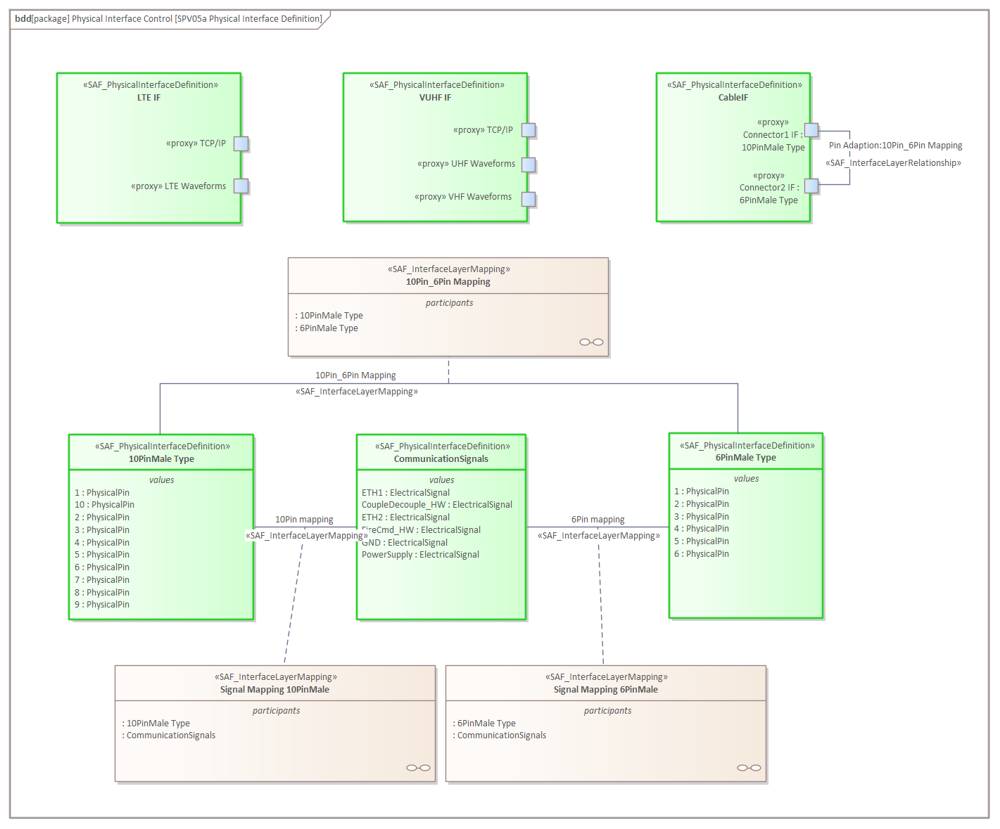
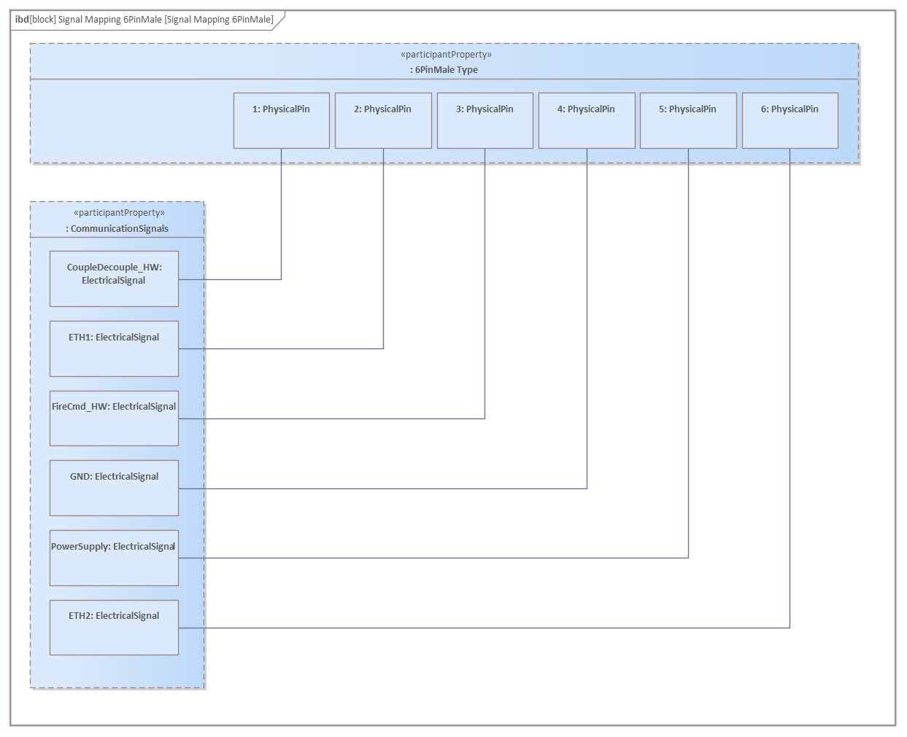

# SPV05a Physical Interface Definition VP

## Purpose
The Physical Interface Definition Viewpoint provides definitions for physical interfaces. These definitions are may be reused on different interfaces.

## Example

## Workflow
**Viewpoint Input:**
* N/A

**Step-by-Step Guide:**
1.  Create a new SAF Physical Interface Definition diagram as specialized [SysML 1.5 Block Definition Diagram](https://sparxsystems.com/enterprise_architect_user_guide/16.1/modeling_languages/block_definition_diagrams.html) in the dedicated package - right-click on the Package, select New Child Diagram > Add Diagram > SAF > BlockDefinition > SAF::SPV05a_PhysicalInterfaceDefinitionView.
2.	Create interface types using SAF_PhysicalInterfaceDefinition from the toolbox.
3.	If needed, refine the interface type by adding subjacent ProxyPorts to the SAF_PhysicalInterfaceDefinition.
4.	If needed added Properties to the SAF_PhysicalInterfaceDefinition by selecting the SAF_PhysicalInterfaceDefinition in the Project Browser - right-click > Add > Flow Property.
5.	If an interface mapping is required (e.g. 10-pins to 6-pins mapping), define Properties (step 4) select the two SAF_PhysicalInterfaceDefinition and set a SAF_InterfaceLayerMapping (Association Block) between them. Add an internal block diagram to the SAF_InterfaceLayerMapping and define the mapping between the properties with connectors.

**Viewpoint Output:**
* SAF_PhysicalInterfaceDefinition which can be used to formalize ProxyPorts in [SFV01c](System-Context-Exchange-Viewpoint.md) and [SLV04b](System-Internal-Exchange-Viewpoint.md).

## Exposed Elements and Connectors
The following Stereotypes / Model Elements are used in the Viewpoint:
* Property
* ProxyPort
* [SAF_PhysicalInterfaceDefinition](https://github.com/GfSE/SAF-Specification/blob/TdSE2023/stereotypes.md#SAF_PhysicalInterfaceDefinition)
* [SAF_InterfaceLayerRelationship](https://github.com/GfSE/SAF-Specification/blob/TdSE2023/stereotypes.md#SAF_InterfaceLayerRelationship)
* [SAF_PhysicalExchangeType](https://github.com/GfSE/SAF-Specification/blob/TdSE2023/stereotypes.md#SAF_PhysicalExchangeType)
* [SAF_PhysicalInterfaceDefinition](https://github.com/GfSE/SAF-Specification/blob/TdSE2023/stereotypes.md#SAF_PhysicalInterfaceDefinition)

## General Recommendations and Pitfalls
* Physical Interfaces addresses used technology.
* Nested port concept should only be used if required to avoid uncessary interface complexity.

[>>> back to cheat sheet overview](../CheatSheet.md)
