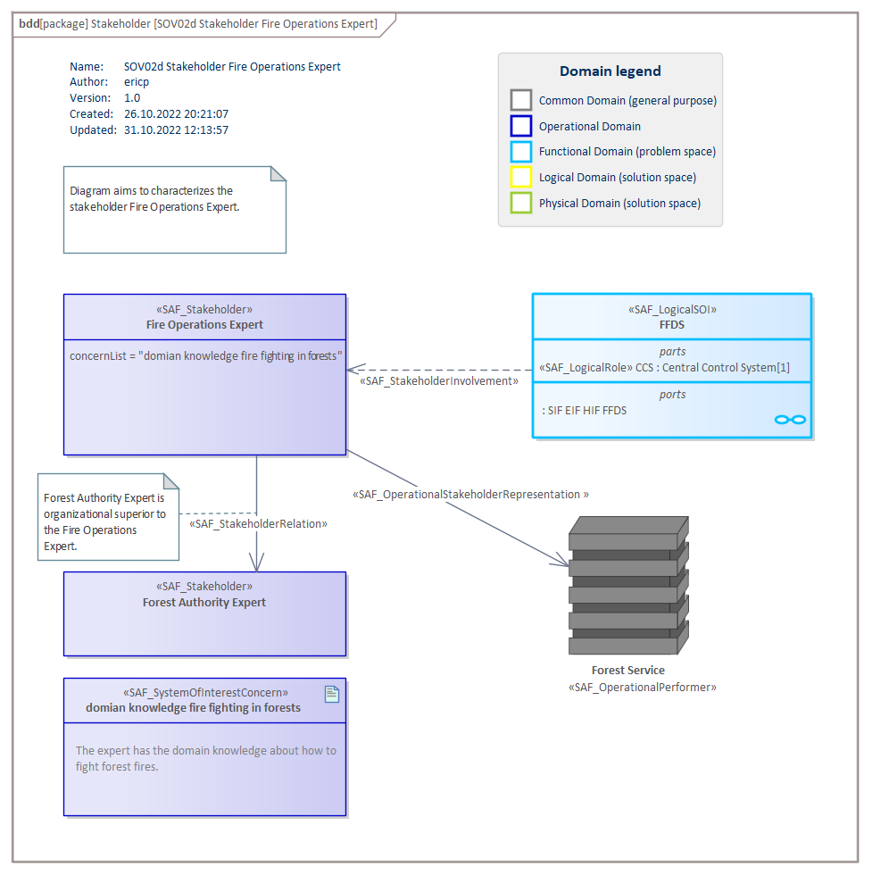

# SOV02d Stakeholder Identification VP

## Purpose
The Stakeholder Identification Viewpoint of the operational domain strives to identify Stakeholders, whose needs shall be considered during the operation of the intended solution and the execution of the operational processes to support the identified operational capabilities. A Stakeholder identification is distinguishing which parties are classified as Stakeholders in a project, either because they can influence the project or because they are directly affected by the result. A Stakeholder analysis is a process of analyzing individuals, teams, or organizations throughout the project life cycle, grouping them according to their levels of participation, interest, and influence in the project, and determining how best to involve and communicate with each of these Stakeholder groups throughout. During the realization of the Intended Solution additional Stakeholders shall be identified having additional needs and requirements, e.g., regarding production of system elements or certain technologies.

## Example

## Workflow
**Viewpoint Input:**
* SAF_OperationalPerformer from [SOV02b](Operational-Performer-Viewpoint.md).
* From external: External domain experts (e.g. legal, standardization, quality…) need to be represented by Stakeholders.

**Step-by-Step Guide:**
1.	Create a new Stakeholder Identification Diagram in the dedicated package in your model as specialized [SysML1.5 Block Definition Diagram](https://sparxsystems.com/enterprise_architect_user_guide/16.1/modeling_languages/block_definition_diagrams.html) with Add Diagram > SAF > BlockDefinition > SAF::SOV02d_StakeholderIdentificationView.
2.	Create a Stakeholder on the diagram.
If the Stakeholder has an interest in the System of Interest, create the System of Interest Concern on the diagram and select the System of Interest Concern in the Stakeholder’s concern list in the property page. If the Stakeholder has multiple concerns press ctrl while selecting the elements.
3.	If the Stakeholder is directly involved in the System of Interest (as an end user or representative) connect the Stakeholder and the System of Interest with the Stakeholder Involvement stereotype.
4.	If the Stakeholder represents or has an interest in a System Context Element (such as the Logical Environment, Logical Context Element or as a Logical User) drag and drop the System Context element onto the diagram (or create a new one) and connect it with the stakeholder with the Context Element Characterization stereotype.
5.	If the Stakeholder is related to one or more other stakeholders, drag and drop them onto the diagram (or create a new one) and connect them with the Stakeholder Relation stereotype.

**Viewpoint Output:**
* Identified Stakeholder for stakeholder requirements elicitation in [SOV06a](Stakeholder-Requirements-Viewpoint.md)
* Identified Stakeholder which needs to be represented as Logical Context Elements [SFV01b](System-Context-Definition-Viewpoint.md) in the Functional Domain.

## Exposed Elements and Connectors
The following Stereotypes / Model Elements are used in the Viewpoint:
* [SAF_Stakeholder](https://github.com/GfSE/SAF-Specification/blob/TdSE2023/stereotypes.md#SAF_Stakeholder)
* [SAF_SystemOfInterestConcern](https://github.com/GfSE/SAF-Specification/blob/TdSE2023/stereotypes.md#SAF_SystemOfInterestConcern)
* [SAF_ContextElementRepresentation](https://github.com/GfSE/SAF-Specification/blob/TdSE2023/stereotypes.md#SAF_ContextElementRepresentation)
* [SAF_OperationalStakeholderRepresentation](https://github.com/GfSE/SAF-Specification/blob/TdSE2023/stereotypes.md#SAF_OperationalStakeholderRepresentation)
* [SAF_StakeholderRelation](https://github.com/GfSE/SAF-Specification/blob/TdSE2023/stereotypes.md#SAF_StakeholderRelation)

## General Recommendations and Pitfalls
* It is highly recommended to consider this viewpoint, even if no OpsCon/ConOps is documented in the project.
* Stakeholders represent Operational Performers. However, other Stakeholders, that never occurred in the OpsCon/ConOps, and their concerns must also be respected. These may include, but are not limited to, company managers who make strategic product design or marketing decisions, authorities that grant releases for their respective markets or dealers who actually sell the product to customers.
* Stakeholders and Stakeholder Concerns should be categorized in order to support a prioritization for the Stakeholder Requirements (see SAF SOV06a Stakeholder Requirement Viewpoint). The categories have to be defined by the project team.
