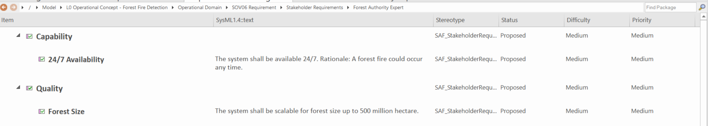
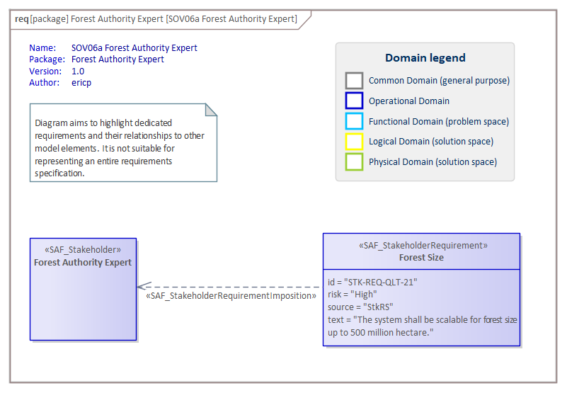

# SOV06a Stakeholder Requirement VP

## Purpose
The Stakeholder Requirement Viewpoint specifies all properties that the intended solution shall possess or expose from the perspective of the Stakeholders. The Stakeholder Requirement Viewpoint determines capabilities, functions, non-functional properties, and constraints.

## Example

## Workflow
Viewpoint Input:
* SAF_Stakeholder which have been identified in SOV02d.
* various sources of stakeholder requirements in Capabilites (SO02c), Processes (SOV03a) and interactions (SOV04a)

Step-by-Step Guide:
1.  Create one package per identified stakeholder within the dedicated stakeholder requirement package.
2.	Open the global Specification Manager (and not the Specification View of a specific diagram).
3.	Select the package for a specific stakeholder.
4.	Document your identified requirements with the Stakeholder Requirements stereotype.
6.	If needed, create (and maintain) matrix specifications to relate Stakeholder Requirements to Stakeholder (using the Stakeholder Requirement Imposition stereotype), System of Interest Concerns (using the Stakeholder Requirement Refinement stereotype) or Operational Stories (using the Stakeholder Requirement Refinement stereotype).
7.	If needed, create a new SAF Stakeholder Requirement diagram to analyze single stakeholder requirements - right-click on the dedicated stakeholder package, select New Child Diagram > Add Diagram > SAF > Requirement > SAF::SOV06a_StakeholderRequirementView. Create new Stakeholder Requirements or drag and drop existing Stakeholder Requirements onto the diagram. Link the Stakeholder Requirements to Operational Stories, System of Interest Concerns or Operational Stakeholder using the Quick Linker.

Viewpoint Output:
* Stakeholder Requirements for System Requirements derivation.

## Exposed Elements and Connectors
The following Stereotypes / Model Elements are used in the Viewpoint:
* [SAF_OperationalStory](https://github.com/GfSE/SAF-Specification/blob/TdSE2023/stereotypes.md#SAF_OperationalStory)
* [SAF_OperationalPerformer](https://github.com/GfSE/SAF-Specification/blob/TdSE2023/stereotypes.md#SAF_OperationalPerformer)
* [SAF_OperationalPerformerActing](https://github.com/GfSE/SAF-Specification/blob/TdSE2023/stereotypes.md#SAF_OperationalPerformerActing)
* [SAF_OperationalSketch](https://github.com/GfSE/SAF-Specification/blob/TdSE2023/stereotypes.md#SAF_OperationalSketch)

## General Recommendations and Pitfalls
* It is required to create one requirement package per stakeholder (as described in the workflow section).
* If different stakeholders have similar or even the same requirement, these should still be described separately for every stakeholder and should not be shared between them. The consolidation of all requirements is subject of the system requirement analysis.
* Stakeholder Requirements should be prioritized, so that it is clearly defined, which requirements are the most important to realize. Priorities can be based on Operational Story prioritization and/or Stakeholder categorization.
* In case the project considers a given Customer Requirement Specification, the according Stakeholder Requirements should be managed in one dedicated stakeholder package.
* The viewpoint does not stipulate a consolidation of contradicting Stakeholder Requirements. A careful consolidation has to be agreed within the project, depending on Stakeholders’ priorities.
