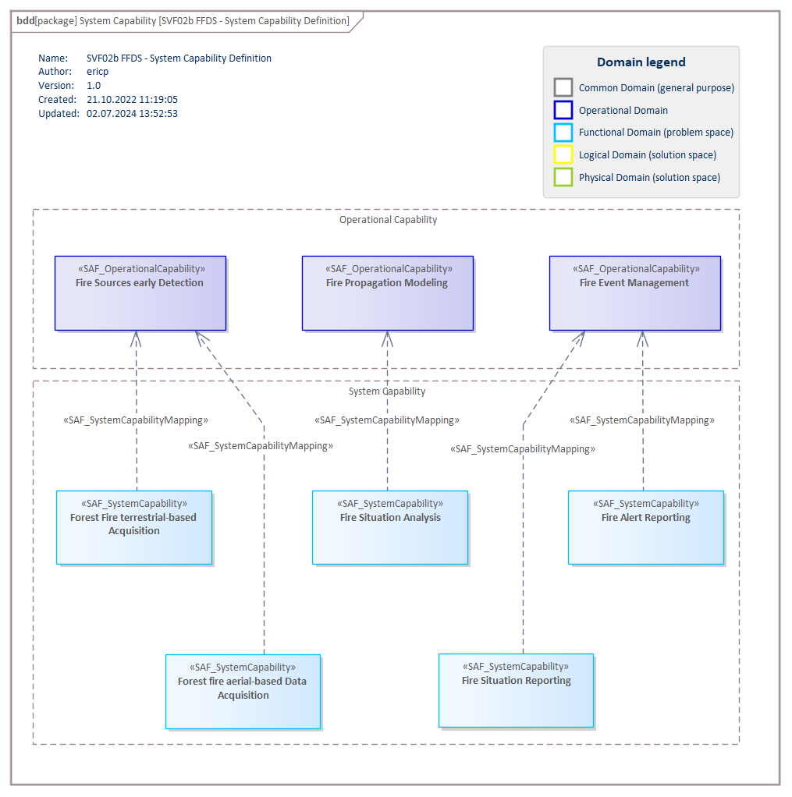

# SFV02b System Capability VP

## Purpose
The System Capability Viewpoint defines a taxonomy of Capabilities including composition, specialization, and dependency relationships between System Capabilities. Note: Connecting capabilities to requirements creates a linkage between two different types of conceptual problem description that helps manage the complexity of the system. At a high level of abstraction, capabilities allow an system architect to plan phases of the system evolution without the need to bear details in mind. Those details will not be lost if they are captured as requirements and traced to a corresponding capability. There is one key difference between capabilities and requirements: Requirements come from different sources, sponsored by different stakeholders, and are usually captured at different levels of abstraction. In contrast, capabilities should always represent a coherent and consolidated view of the system.

## Example

## Workflow
**Viewpoint Input:**
* SAF_OperationalCapability to be referenced from [SOV02c](Operational-Capability-Viewpoint.md)

**Step-by-Step Guide:**
1.  Create a new System Capability Diagram in the dedicated package in your model as specialized [SysML1.5 Block Definition Diagram](https://sparxsystems.com/enterprise_architect_user_guide/16.1/modeling_languages/block_definition_diagrams.html) with Add Diagram > SAF > BlockDefinition > SAF::SFV02b_SystemCapabilityView.
2.	Drag and drop Operational Capabilities onto the diagram.
3.	Derive and add new System Capabilities on the diagram.
4.	Establish a relationship between Operational Capabilities and System Capabilities using the System Capability Enabling stereotype.
5.	If needed define System Capability Composition, Generalization and Dependencies between System Capabilities. Please note that the composition must be set from parent to child.

**Viewpoint Output:**
* System Capability is an input source for System Requirements in [SFV06a](System-Requirement-Viewpoint.md)

## Exposed Elements and Connectors
The following Stereotypes / Model Elements are used in the Viewpoint:
* [SAF_SystemCapability](https://saf.gfse.org/userdoc/stereotypes.html#saf_systemcapability)
* [SAF_SystemCapabilityComposition](https://saf.gfse.org/userdoc/stereotypes.html#saf_systemcapabilitycomposition)
* [SAF_SystemCapabilityDependency](https://saf.gfse.org/userdoc/stereotypes.html#saf_systemcapabilitydependency)
* [SAF_SystemCapabilityGeneralization](https://saf.gfse.org/userdoc/stereotypes.html#saf_systemcapabilitygeneralization)
* [SAF_OperationalCapability](https://saf.gfse.org/userdoc/stereotypes.html#saf_operationalcapability)
* [SAF_SystemCapabilityEnabling](https://saf.gfse.org/userdoc/stereotypes.html#saf_systemcapabilityenabling)

## General Recommendations and Pitfalls
* System Capabilities can be used as element type for product features as part of a product feature roadmap / planning.
* When deriving System Capabilities from Operational Capabilities, it has to be ensured that the System Capabilities fit to the System of Interest definition. Also, System Capabilities should fit to the defined System Stories. Both these relations are not documented in any viewpoint but have to be respected to ensure a consistent definition of the System of Interest.

[>>> back to cheat sheet overview](../CheatSheet.md)
