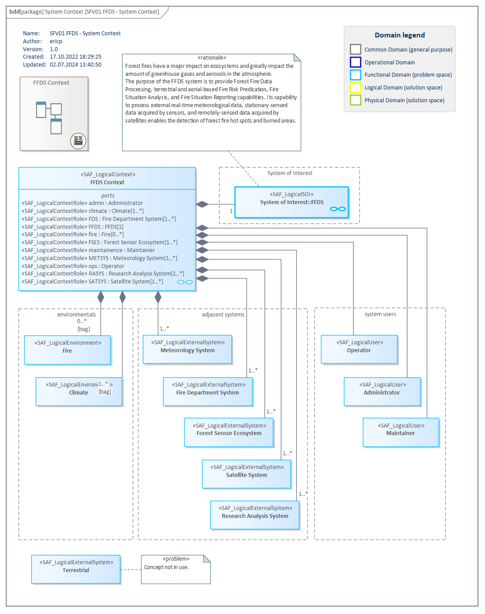

# SFV01b System Context Definition VP

## Purpose
The System Context Definition Viewpoint defines how the SOI is embedded in its environment, i.e., where the boundary of the SOI is and who the external entities are the SOI interacts with (e.g., users, other external systems, environmental conditions, etc.). The SOI provides and requests context functions. The SOI shall be able handle events and effects from the outside. In addition, the System Context Definition Viewpoint serves as architecture concept to demonstrate how the architecture description defined in the Operational Context Definition Viewpoint is realized.

## Example

## Workflow
**Viewpoint Input:**
* N/A

**Step-by-Step Guide:**
1.	Create a new System Context Definition diagram as specialized [SysML1.5 Block Definition Diagram](https://sparxsystems.com/enterprise_architect_user_guide/16.1/modeling_languages/block_definition_diagrams.html) in the dedicated package in your model with Add Diagram > SAF > BlockDefinition > SAF::SFV01b_SystemContextDefinitionView.
2.	Create a Logical System Context to the diagram.
3.	Create a Logical SOI and Logical Context Elements (e.g., a Logical User, Logical External System, or the Logical Environment).
4.	Create Logical Context Roles by using the composition relationship. Please note that the composition must be set from the System Context to the Logical SOI and Logical Context Elements.
5.	Give the Logical Context Role a meaningful name by selecting the part property in the Operational Context and amending the name on the property element page for traceability purposes in matrix specifications. 
6.	If needed, define the multiplicity for the Logical Context Roles.

**Viewpoint Output:**
* Logical SOI to all futher viewpoints in the Functional Domain
* Logical Context Elements (e.g., a Logical User, Logical External System, or the Logical Environment) are referenced in [SFV01a](System-Use-Case-Viewpoint.md)
* Logical Context itself is referenced in [SFV01a](System-Use-Case-Viewpoint.md) as System Use Case subject
* the Logical Context Roles used in viewpoints [SFV01c](System-Context-Exchange.md), [SFV03a](System-Process-Viewpoint.md) and [SFV04a](System-Context-Interaction-Viewpoint.md) 

## Exposed Elements and Connectors
The following Stereotypes / Model Elements are used in the Viewpoint:
* [SAF_LogicalContext](https://github.com/GfSE/SAF-Specification/blob/TdSE2023/stereotypes.md#SAF_LogicalContext)
* [SAF_LogicalContextRole](https://github.com/GfSE/SAF-Specification/blob/TdSE2023/stereotypes.md#saf_logicalcontextrole) contained in SAF_LogicalContext
* [SAF_LogicalEnvironment](https://github.com/GfSE/SAF-Specification/blob/TdSE2023/stereotypes.md#SAF_LogicalEnvironment)
* [SAF_LogicalExternalSystem](https://github.com/GfSE/SAF-Specification/blob/TdSE2023/stereotypes.md#SAF_LogicalExternalSystem)
* [SAF_LogicalSOI](https://github.com/GfSE/SAF-Specification/blob/TdSE2023/stereotypes.md#SAF_LogicalSOI)
* [SAF_LogicalUser](https://github.com/GfSE/SAF-Specification/blob/TdSE2023/stereotypes.md#SAF_LogicalUser)

## General Recommendations and Pitfalls
* At least one System Context is required for a model. It is possible however, to create several System Contexts with different scopes. However, a holistic system context view has to be created.
* Different System Contexts should be defined if the scopes of these differ largely. This could be e.g. due to functional ambiguities between different System Stories or different System scopes (e.g. different life phases).
* All System Stories should be covered by a System Context.

[>>> back to cheat sheet overview](../CheatSheet.md)
