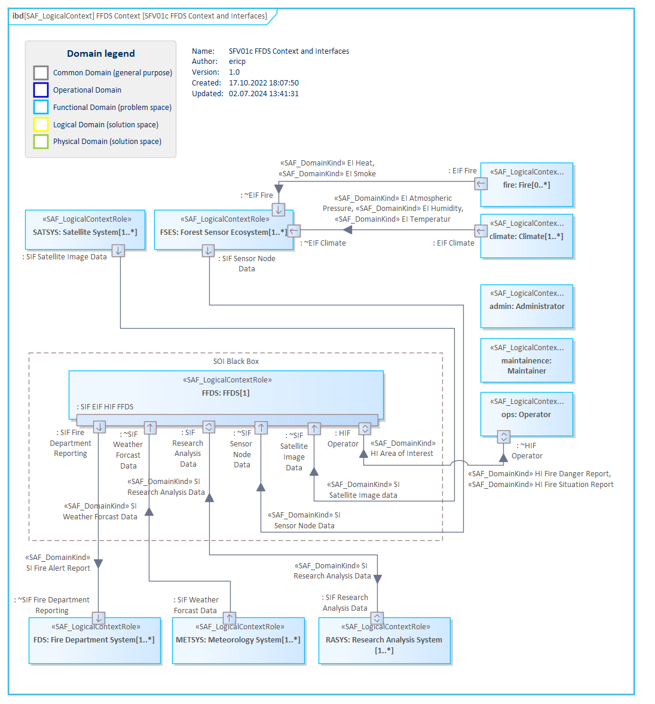

# SFV01c System Context Exchange VP

## Purpose
The System Context Exchange Viewpoint serves for the identification and definition of external interfaces of the SOI that are used to interact, e.g., users, external systems, and other external entities defined in the given context of the SOI. The System Context Exchange Viewpoint
* identifies system interfaces on a functional level,
* states to which external entities the system interfaces are connected to,
* assigns interface documents to system interfaces,
* and defines the usage of interfaces, e.g., when only a subset of the interface is used.

## Example

## Workflow
**Viewpoint Input:**
* instantiated Logical Context Roles within the System Context from [SFV01b](System-Context-Definition-Viewpoint.md)
* SAF_DomainItemKind as exchange items between Logical Context Roles from [SFV02a](System-Domain-Item-Kind-Viewpoint.md)
* SAF_ConceptualInterfaceDefinition from [SFV05a](System-Interface-Definition-Viewpoint.md) to formalize SoI's external interfaces.

**Step-by-Step Guide:**
1.	Select a System Context and add a new System Context Exchange Diagram as a specialized [SysML1.5 Internal Block Diagram](https://sparxsystems.com/enterprise_architect_user_guide/16.1/modeling_languages/internal_block_diagram.html) with Add Diagram > SAF > InternalBlock > SAF::SFV01c_SystemContextExchangeView.
2.	Drag and drop the involved Logical Context Roles from the System Context onto the System Context Exchange Diagram.
3.	Add new required interfaces as Proxy Ports to the Logical Context Role or select the needed required Proxy Ports from the property’s Feature Page > Interaction Points.
4.	For new Proxy Ports select or create an SAF_ConceptualInterfaceDefinition by selecting the Proxy Port > Properties > Property > Define > Type > Select Type ...
5.	If needed add FlowProperties to the SAF_ConceptualInterfaceDefinition to refine the interface or visualize a direction.
6.	Create a connector between the Logical Context Role’s Proxy Port of the SOI and the Logical Context Role of a context element. If required, connect to a Proxy Port of the Logical Context Role of a context element.
7.	If the Logical Context Roles exchange information, energy, or material establish an Item Flow and select the according Domain Kind. Select the Connector > right-click on the Connector > Advanced > Information Flow Realized > Select the Domain Kind(s)

**Viewpoint Output:**
* ItemFlows established can be reused in [SFV03a](System-Process-Viewpoint.md) and [SFV04a](System-Context-Interaction-Viewpoint.md)
* external Interfaces as ProxyPorts can be reused in [SLV04b](Logical-Internal-Exchange-Viewpoint.md)
* external Interfaces as ProxyPorts are an input source for System Requirements and are traced accordingly in [SFV08b](System-Requirement-Traceability-Viewpoint.md)

## Exposed Elements and Connectors
The following Stereotypes / Model Elements are used in the Viewpoint:
* Connector
* FlowProperty
* ItemFlow
* ProxyPort
* [SAF_LogicalContextRole](https://github.com/GfSE/SAF-Specification/blob/TdSE2023/stereotypes.md#saf_logicalcontextrole)
* [SAF_ConceptualInterfaceDefinition](https://github.com/GfSE/SAF-Specification/blob/TdSE2023/stereotypes.md#SAF_ConceptualInterfaceDefinition)
* [SAF_DomainKind](https://github.com/GfSE/SAF-Specification/blob/TdSE2023/stereotypes.md#SAF_DomainKind)

## General Recommendations and Pitfalls
*	If interfaces are required by technical necessity of the System of Interest, but were not required by a Stakeholder, they should still be added to the System Context Exchange Viewpoint. Interfaces can also be derived in the design phase.
*	For interfaces which are derived and were not required initially by a Stakeholder, assign a rationale to the according Proxy Port.
*	For definition of (external) interfaces create a separate bdd for InterfaceBlocks, ProxyPorts and FlowProperties.

[>>> back to cheat sheet overview](../CheatSheet.md)
