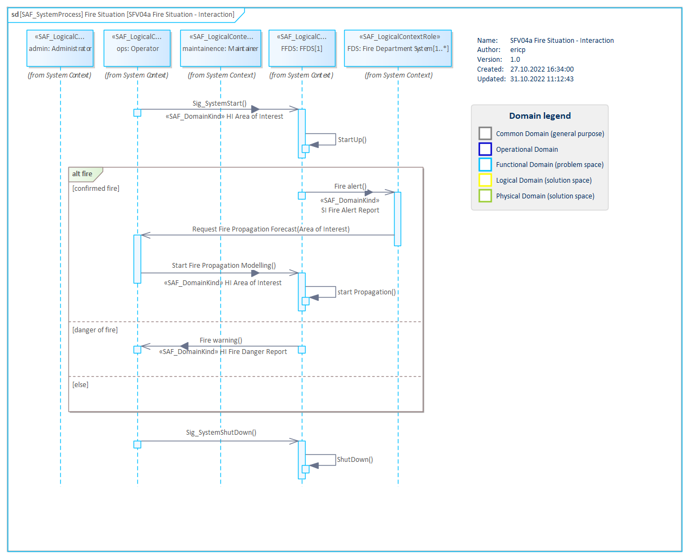

# SFV04a System Context Interaction VP

## Purpose
The System Context Interaction Viewpoint describes the System external behavior based on the exchange between Logical SOI and Logical Context Elements Usage in a given System Context. It depicts the sequence of interactions between the Logical SOI, the Context Elements and the exchanged Domain Item Kinds needed to accomplish a given System Process. Note: The System Context Interaction Viewpoint may refine a System Use Case.

## Example

## Workflow
**Viewpoint Input:**
* SAF_SystemUseCase from [SFV01a](System-Use-Case-Viewpoint.md) which needs refinement
* itemFlows from [SFV01c](System-Context-Exchange-Viewpoint.md)

**Step-by-Step Guide:**
1.	Create a System Process item in the dedicated package in your model to formalize a System Story or analyze further the SOI’s contribution in an Operational Process.
2.	Create a new SAF System Context Interaction diagram as specialized [SysML 1.5 Sequence Diagram](https://sparxsystems.com/enterprise_architect_user_guide/16.1/modeling_languages/sysml-seq-diagram.html) for the new System Process - right-click on the System Process, select Add > Add Diagram > SAF > Sequence > SAF::SFV04a_SystemContextInteractionView.
3.	Drag and drop Logical Roles onto the diagram which are involved in the interaction.
4.	Define the sequence in the interaction with messages.
5.	Select the message > right-click on the Connector > Advanced > Information Flow Realized > Select the available Operational Domain Kind(s).

**Viewpoint Output:**
* new created itemFlows to [SFV01c](System-Context-Exchange-Viewpoint.md)
* interactions are in input source for system requirements and are traced accordingly in [SFV08b](System-Requirement-Traceability-Viewpoint.md)

## Exposed Elements and Connectors
The following Stereotypes / Model Elements are used in the Viewpoint:
* [SAF_OperationalStory](https://saf.gfse.org/userdoc/stereotypes.html#saf_operationalstory)
* [SAF_OperationalPerformer](https://saf.gfse.org/userdoc/stereotypes.html#saf_operationalperformer)
* [SAF_OperationalPerformerActing](https://saf.gfse.org/userdoc/stereotypes.html#saf_operationalperformeracting)
* [SAF_OperationalSketch](https://saf.gfse.org/userdoc/stereotypes.html#saf_operationalsketch)

* Interaction
* Lifeline
* Message
* [SAF_LogicalContextRole](https://saf.gfse.org/userdoc/stereotypes.html#saf_logicalcontextrole)

## General Recommendations and Pitfalls
* While this viewpoint uses other model elements than [SOV04a](Operational-Interaction-Viewpoint.md) and should be more detailed (e.g. it is possible to use specific message IDs in this viewpoint, which should be avoided in [SOV04a](Operational-Interaction-Viewpoint.md), it is very easy to essentially model the same content in both viewpoints. This should be avoided.
* In general, it is recommended to use System Processes to formalize System Stories on this level and only use System Context Interactions when specifically necessary. To show interactions between Systems, it is recommended to use Operational Interactions. However, there can be situations where the use of System Context Interactions in addition to System Processes delivers important additional information and should be incorporated into the model (e.g., when there are timing sensitive aspects in the interaction between the System of Interest and other Logical Roles).

[>>> back to cheat sheet overview](../CheatSheet.md)
