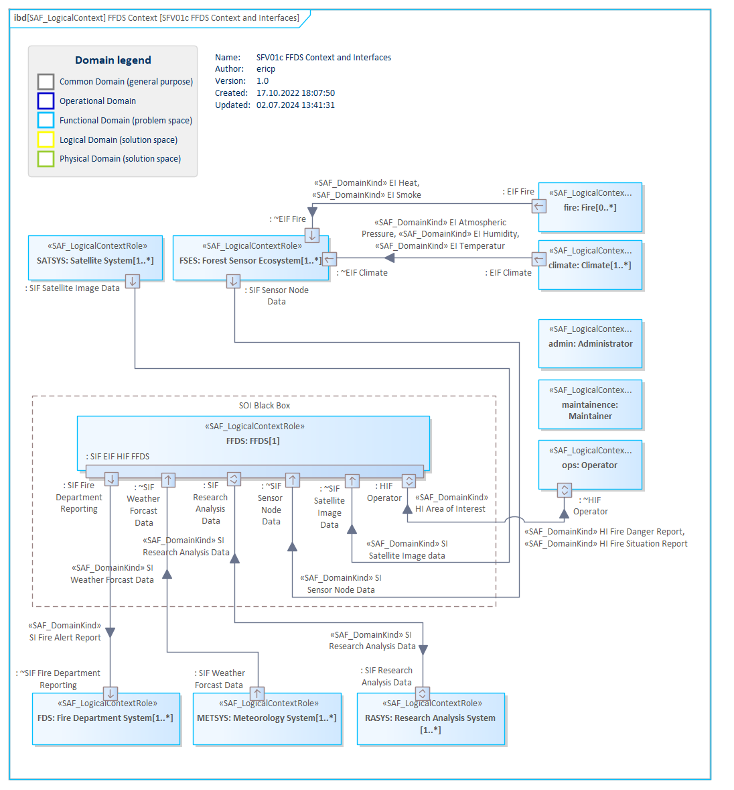

# SFV02a System Domain Item Kind VP

## Purpose
The System Domain Item Kind Viewpoint captures system wide concepts and collects type definitions for any exchanged item, e.g., information, material, or energy, of the Functional and Logical domain. Its purpose is to define these item types and their relationships. Furthermore, the System Domain Item Kind Viewpoint specifies the data types, entity types, related value types, and units that are used by the SOI. Note: Domain Item Kinds are used as types of function input and output in the Functional Domain, and for types of interfaces in the Logical Domain. They specify what is to be exchanged but not how.

## Example

## Workflow
**Viewpoint Input:**
* SAF_OperationalDomainItemKinds from [SOV02a](Operational-Domain-Item-Kind-Viewpoint.md) can be referenced in this viewpoint.

**Step-by-Step Guide:**
1.	Create a new System Domain Kind diagram as specialized [SysML1.5 Block Definition Diagram](https://sparxsystems.com/enterprise_architect_user_guide/16.1/modeling_languages/block_definition_diagrams.html) with Add Diagram > SAF > BlockDefinition > SAF::SFV02a_SystemDomainKindView.
2.	Create new Domain Kind which is required e.g., to describe an exchange of information, energy, or material between Logical Context Roles or to type a flow property.
3.	Drag and Drop Operational Domain Kind(s) onto the diagram and establish a relationship with the Domain Kind using the Domain Kind Derivation stereotype.
4.	If needed, you can formalize the Domain Kind attributes with value types or enumerations.
5.	If needed, you can establish a Domain Kind Composition, an association, or a generalization relationship between two Domain Kinds. Please note that the composition must be set from parent to child.

**Viewpoint Output:**
* Created SAF_DomainItemKind elements can be used in [SFV01c](System-Context-Exchange-Viewpoint,md), [SFV03a](System-Process-Viewpoint.md) and [SFV04a](System-Context-Interaction-Viewpoint.md)

## Exposed Elements and Connectors
The following Stereotypes / Model Elements are used in the Viewpoint:
* [SAF_DomainKindComposition](https://github.com/GfSE/SAF-Specification/blob/TdSE2023/stereotypes.md#SAF_DomainKindComposition)
* [SAF_DomainKindDerivation](https://github.com/GfSE/SAF-Specification/blob/TdSE2023/stereotypes.md#SAF_DomainKindDerivation)
* [SAF_DomainKind](https://github.com/GfSE/SAF-Specification/blob/TdSE2023/stereotypes.md#SAF_DomainKind)
* [SAF_OperationalDomainKind](https://github.com/GfSE/SAF-Specification/blob/TdSE2023/stereotypes.md#SAF_OperationalDomainKind)

## General Recommendations and Pitfalls
* It is strongly recommended to add information to each System Domain Kind for a better understanding and in order to avoid creating the same System Domain Kind twice with different names. This information should be added as rationales in this viewpoint.
* If System Domain Kinds were created in other viewpoints, they will not be added to this viewpoint automatically. They have to be added manually to keep this viewpoint up to date.
* While there is no technical limitation to the number of System Domain Item Kind viewpoints per project, it is strongly recommended to only have one per project.

[>>> back to cheat sheet overview](../CheatSheet.md)
