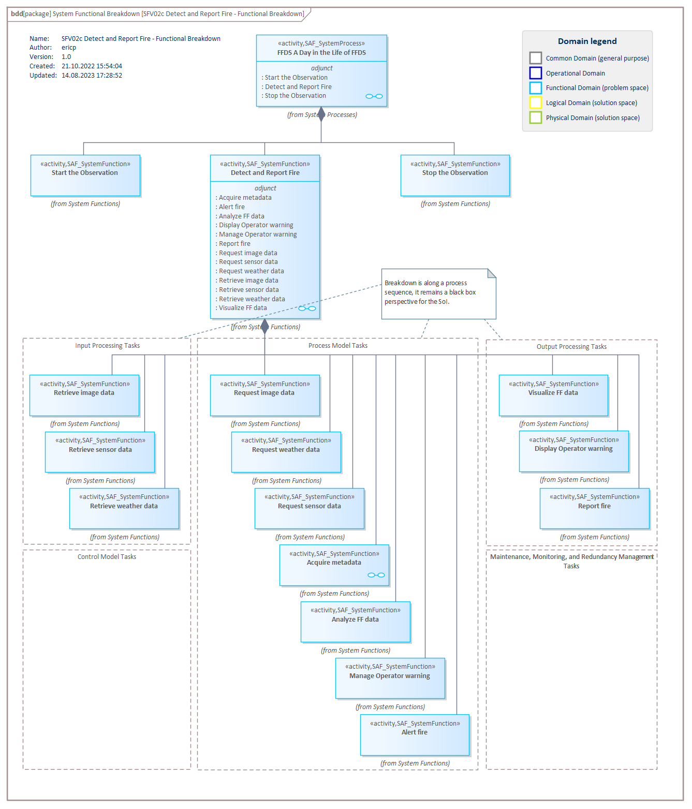

# SFV02c System Functional Breakdown VP

## Purpose
The System Functional Breakdown Structure Viewpoint defines the structured, modular breakdown of the SOI beginning with System Processes, over identified System Functions further refined down to System Partial Functions. The reuse of System Functions, and System Partial Functions over Function Trees of the SOI is facilitated. Unlike a Work Breakdown Structure (WBS), the Functional Breakdown Structure (FBS) is a function-oriented tree, not a product-oriented one.

## Example

## Workflow
**Viewpoint Input:**
* N/A

**Step-by-Step Guide:**
1.	Create a System Process item in the dedicated package in your model to formalize a System Story or analyze further the SOI’s contribution in an Operational Process.
2.	Create a new System Functional Breakdown Diagram in the dedicated package in your model as specialized [SysML1.5 Block Definition Diagram](https://sparxsystems.com/enterprise_architect_user_guide/16.1/modeling_languages/block_definition_diagrams.html) with Add Diagram > SAF > BlockDefinition > SAF::SFV02c_SystemFunctionalBreakdownView.
3.	Drag and drop an existing System Process onto the diagram.
4.	Define and create System Function(s) which are needed to perform the System Process.
5.	Create a composition between the System Process and System Function. Please note that the composition must be set from System Process as parent to System Function as child.

**Viewpoint Output:**
* SAF_SystemProcess can be refined in [SFV03a](System-Process-Viewpoint.md)
* SAF_SystemFunction can be instantiated as SAF_FunctionAction / SAF_ContextAction in [SFV03a](System-Process-Viewpoint.md)
* SAF_SystemPartialFunction can be instantiated as SAF_FunctionAction in [SFV03c](SystemFunctionalRefinement.md)

## Exposed Elements and Connectors
The following Stereotypes / Model Elements are used in the Viewpoint:
* Composition
* [SAF_SystemProcess](https://saf.gfse.org/userdoc/stereotypes.html#saf_systemprocess)
* [SAF_SystemFunction](https://saf.gfse.org/userdoc/stereotypes.html#saf_systemfunction)
* [SAF_SystemPartialFunction](https://saf.gfse.org/userdoc/stereotypes.html#saf_systempartialfunction)

## General Recommendations and Pitfalls
* If boundaries are given for the design of the System of Interest (e.g., certain system components are pre-determined by a stakeholder), these should be respected in the definition of the System Functions. While this viewpoint is still a Blackbox viewpoint, it is the basis for the further functional breakdown in the Whitebox design.
* It is important to ensure a consistency between this viewpoint and SAF SFV03a System Process Viewpoint. Therefore, the Functional Breakdown of each System Process should be validated against its Process View, ensuring that the breakdown covers all in- and outputs of the process and the functions required to fulfill its purpose.

[>>> back to cheat sheet overview](../CheatSheet.md)
