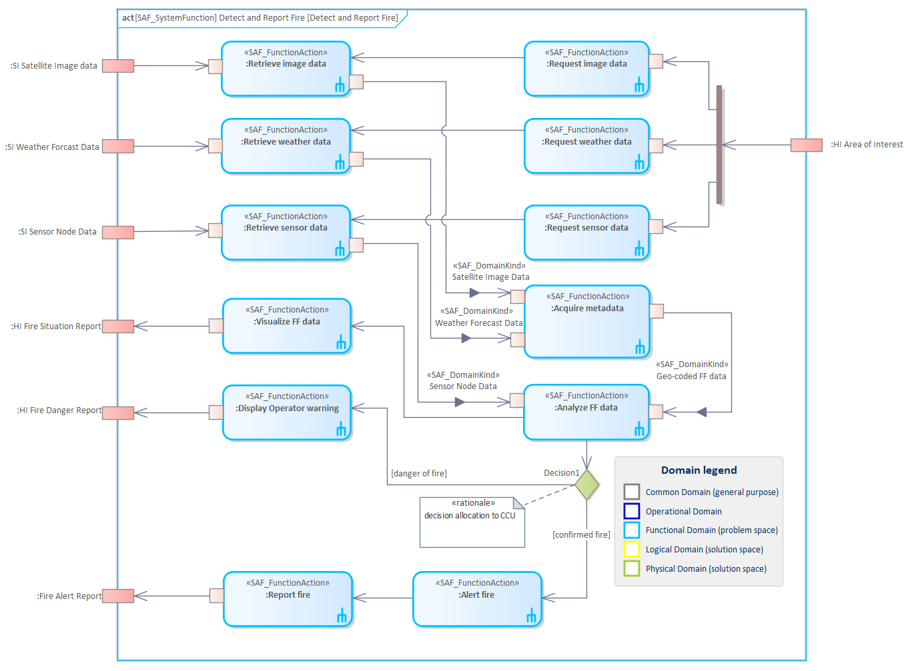

# SFV03c System Functional Refinement VP

## Purpose
The System Functional Refinement Viewpoint analyses decomposition of System Functions into System Partial Functions in order achieve understanding and agreement about the System functions sufficient to derive system requirements.

## Example

## Workflow
**Viewpoint Input:**
* defined SAF_SystemFunction from [SFV02c](System-Functional-Breakdown-Viewpoint.md) which has to be refined
* defined SAF_DomainItemKind from [SFV02a](System-Domain-Item-Kind-Viewpoint.md) for ObjectFlows
* SAF_LogicalInternalRole from [SLV02a](Logical-Structure-Viewpoint.md)
* defined exchanges from [SLV04a](Logical-Internal-Exchange-Viewpoint.md) and [SLV04b](Logical-Internal-Interactions-Viewpoint.md)

**Step-by-Step Guide:**
1.  Create a new SAF System Functional Refinement diagram as specialized [SysML 1.5 Activity Diagram](https://sparxsystems.com/enterprise_architect_user_guide/16.1/modeling_languages/sysml_activity_diagram.html) below a System Function - right-click on the System Function, select New Child Diagram > Add Diagram > SAF > Activity > SAF::SFV03c_SystemFunctionalRefinementView.
2.	Drag and drop an involved Logical Elements onto the diagram and create a Logical Internal Role by selecting partition in the dialog. Name the Logical Internal Role according to the Logical Internal Role in the Logical SOI.
3.	Add Function Actions to the according AllocateActivity-Partition.
4.	Set the behavior classifier to the created System Function by right-click on the action > Advanced > Set Behavior Classifier.
5.	If no corresponding System Partial Function is available, create a new element in [SFV02c](System-Functional-Breakdown-Viewpoint.md). Proceed with step 4.
6.	Model control and object flows by using the Quick Linker. For object flows you can set the type of the action pins to a Domain Kind in the pin properties.
7.	Establish and maintain an allocation between System Function Actions and Logical SOI’s Logical Internal Roles in [SLV08a](Logical-Functional-Mapping-Viewpoint.md).

**Viewpoint Output:**
* flow of material, energy or information is captured in [SLV04b](Logical-Internal-Exchange-Viewpoint.md)
* Trigger might have an impact on the system state machine in [SFV03b](System-State-Viewpoint.md)

## Exposed Elements and Connectors
The following Stereotypes / Model Elements are used in the Viewpoint:
* ControlFlow
* InputPin
* ObjectFlow
* Trigger
* OutputPin
* Parameter
* [SAF_LogicalInternalRole](https://saf.gfse.org/userdoc/stereotypes.html#saf_logicalcontextrole)
* [SAF_FunctionAction](https://saf.gfse.org/userdoc/stereotypes.html#saf_functionaction)
* [SAF_SystemFunction](https://saf.gfse.org/userdoc/stereotypes.html#saf_systemfunction)
* [SAF_SystemPartialFunction](https://saf.gfse.org/userdoc/stereotypes.html#saf_systempartialfunction)

## General Recommendations and Pitfalls
* If design constraints are given for the System of Interest, its logical breakdown, or interfaces, it is important to respect these in this viewpoint, even if the details are not visible directly. Therefore, Function Actions have to allocated to suiting Logical Internal Roles.
* It is important to ensure a consistency between this viewpoint and [SFV02c](System-Functional-Breakdown-Viewpoint.md). Therefore, the System Functional Refinement Viewpoint should be validated against its Functional breakdown, ensuring that the breakdown covers all in- and outputs of the process and the functions required to fulfill its purpose.
* As the Enterprise Architect does not allocate the Function Actions automatically when they are moved into a partition, it is very important to maintain the allocation matrix in SLV08a.

[>>> back to cheat sheet overview](../CheatSheet.md)
