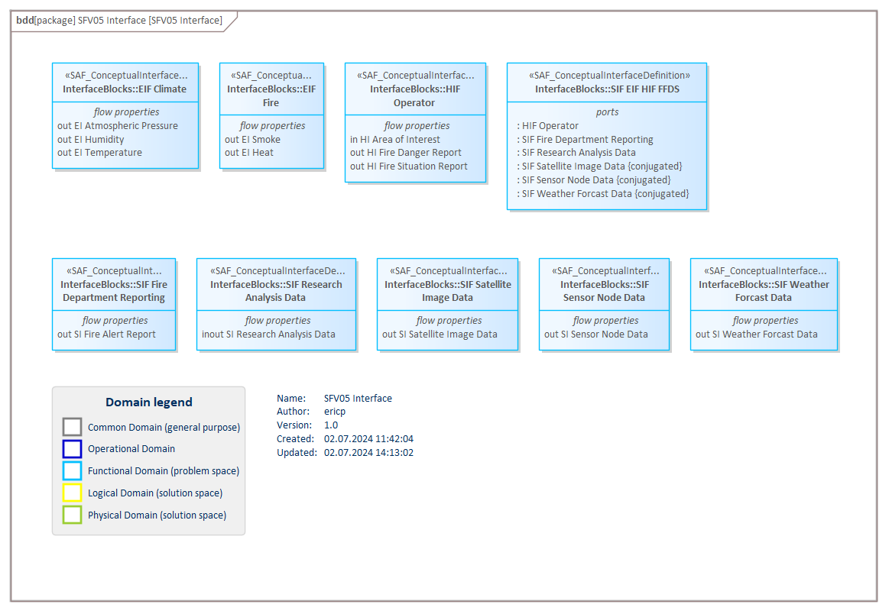

# SFV05a System Interface Definition VP

## Purpose
The System Interface Definition Viewpoint captures system wide concepts defining interfaces. It allows to adopt long-lived standards and to harmonize the interface definitions to improve interchangeability, interoperability, and portability.

## Example

## Workflow
**Viewpoint Input:**
* N/A

**Step-by-Step Guide:**
1.  Create a new SAF System Interface Identification diagram as specialized [SysML 1.5 Block Definition Diagram](https://sparxsystems.com/enterprise_architect_user_guide/16.1/modeling_languages/block_definition_diagrams.html) in the dedicated package - right-click on the Package, select New Child Diagram > Add Diagram > SAF > BlockDefinition > SAF::SFV05a_SystemInterfaceDefinitionView.
2.	Create interface types using SAF_ConceptualInterfaceDefinition from the toolbox.
3.	If needed, refine the interface type by adding subjacent ProxyPorts to the SAF_ConceptualInterfaceDefinition.

**Viewpoint Output:**
* SAF_ConceptualInterfaceDefinition which can be used to formalize ProxyPorts in [SFV01c](System-Context-Exchange-Viewpoint.md) and [SLV04b].

## Exposed Elements and Connectors
The following Stereotypes / Model Elements are used in the Viewpoint:
* ProxyPort
* [SAF_ConceptualInterfaceDefinition](https://github.com/GfSE/SAF-Specification/blob/TdSE2023/stereotypes.md#SAF_ConceptualInterfaceDefinition)

## General Recommendations and Pitfalls
* Conceptual Interfaces should be whenever possible technology-free. This is the scope in viewpoint [SPV05a].
* Nested port concept should only be used if required to avoid uncessary interface complexity.

[>>> back to cheat sheet overview](../CheatSheet.md)
