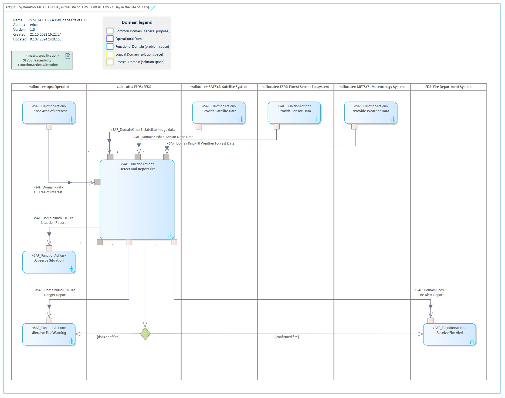

# SFV03a System Process VP

## Purpose
The System Process Viewpoint provides the functional representation of the system using a black-box approach
* the representation of the SOI and all Context Elements
* the System Functions the SOI shall be able to perform
* the Context Functions the Context Elements are expected to perform
* the exchange between SOI System Functions and Context Functions of Context Elements
* the functional flows crossing the boundary between SOI and Context Elements

## Example

## Workflow
**Viewpoint Input:**
* defined SAF_SystemProcess, SAF_SystemFunction and SAF_PartialSystemFunction from [SFV02c](System-Functional-Breakdown-Viewpoint.md)
* defined SAF_LogicalContextRole from [SFV01b](System-Context-Definition-Viewpoint.md)
* defined SAF_DomainItemKind from [SFV02a](System-Domain-Item-Kind-Viewpoint.md)

**Step-by-Step Guide:**
1.  Create a new SAF System Process diagram as specialized [SysML 1.5 Activity Diagram](https://sparxsystems.com/enterprise_architect_user_guide/16.1/modeling_languages/sysml_activity_diagram.html) below a System Process in its dedicated package - right-click on the System Process, select New Child Diagram > Add Diagram > SAF > Activity > SAF::SFV03a_SystemProcessView.
2.	Drag and drop an involved Logical SOI or Logical Context Elements onto the diagram and create a Logical Context Role by selecting partition in the dialog. Name the Logical Role according to the Logical Context Role in the System Context.
3.	Add Function Actions to the according AllocateActivity-Partition.
4.	Set the behavior classifier to the created System Function by right-click on the action > Advanced > Set Behavior Classifier.
5.	If no corresponding System Function is available, create a new element in [SFV02c](System-Functional-Breakdown-Viewpoint.md).. Proceed with step 4.
6.	Model control and object flows by using the Quick Linker. For object flows you can set the type of the action pins to a Domain Kind in the pin properties.
7.	Establish and maintain an allocation between System Function Actions and System Context’s Logical Context Roles in [SLV08a](Logical-Functional-Mapping-Viewpoint.md).

**Viewpoint Output:**
* flow of material, energy or information is captured in [SFV01c](System-Context-Exchange-Viewpoint.md)
* used trigger have an impact on the SOI's state machine in [SFV03b](System-State-Viewpoint.md) 

## Exposed Elements and Connectors
The following Stereotypes / Model Elements are used in the Viewpoint:
* ControlFlow
* InputPin
* ObjectFlow
* OutputPin
* Parameter
* Trigger
* [SAF_LogicalContextRole](https://saf.gfse.org/userdoc/stereotypes.html#saf_logicalcontextrole)
* [SAF_ContextAction](https://saf.gfse.org/userdoc/stereotypes.html#saf_contextaction)
* [SAF_ContextFunction](https://saf.gfse.org/userdoc/stereotypes.html#saf_contextfunction)
* [SAF_FunctionAction](https://saf.gfse.org/userdoc/stereotypes.html#saf_functionaction)
* [SAF_SystemFunction](https://saf.gfse.org/userdoc/stereotypes.html#saf_systemfunction)
* [SAF_SystemProcess](https://saf.gfse.org/userdoc/stereotypes.html#saf_systemprocess)

## General Recommendations and Pitfalls
* If design constraints are given for the System of Interest, its interfaces, or Context Elements, it is important to respect these in this viewpoint, even if the details are not visible directly.
* It is important to ensure a consistency between this viewpoint and [SFV02c](System-Functional-Breakdown-Viewpoint.md). Therefore, the System Process Viewpoint should be validated against its Functional breakdown, ensuring that the breakdown covers all in- and outputs of the process and the functions required to fulfill its purpose.
* Neither for the System of Interest nor for the System Context Roles should internal functionalities be described.
* As the Enterprise Architect does not allocate the Function Actions automatically when they are moved into a partition, it is very important to maintain the allocation matrix in SLV08a.

[>>> back to cheat sheet overview](../CheatSheet.md)
