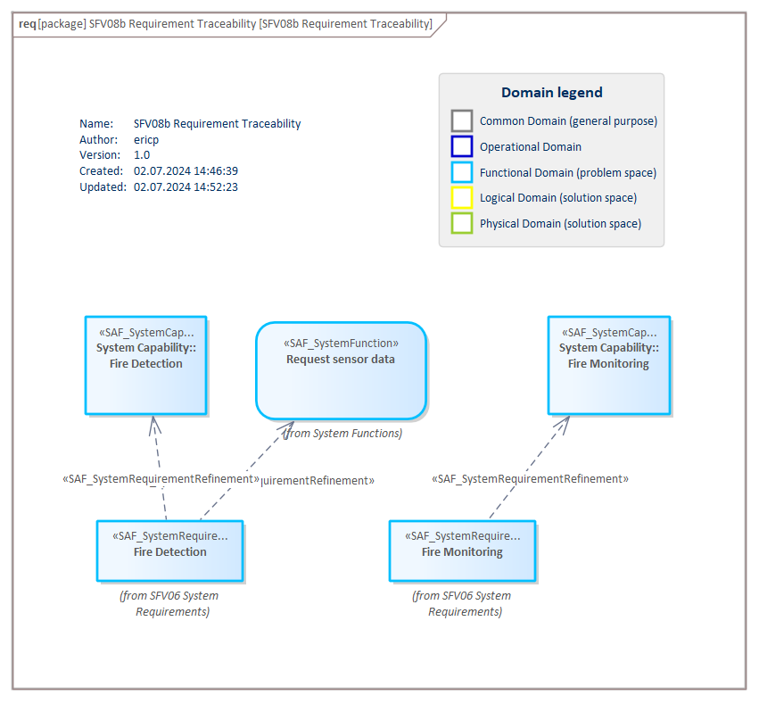
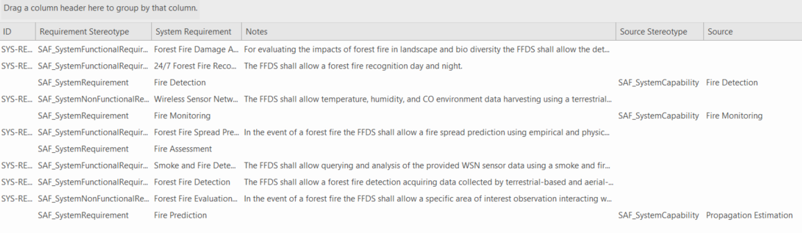

# SFV08b System Requirement Traceability VP

## Purpose
The System Requirement Traceability Viewpoint specifies for every System Requirement the traceability to the functional domain level
* System Use Case
* System Capability
* System Context Definition
* System Context Exchange
* System Context Interaction
* System Process
* System State

## Example

## Workflow
**Viewpoint Input:**
* System Use Case from [SFV01a](System-Use-Case-Viewpoint.md)
* System Capability from [SFV02b](System-Capability-Viewpoint.md)
* Stakeholder Requirement from [SOV06a](Stakeholder-Requirement-Viewpoint.md)
* ProxyPorts from [SFV01c](System-Context-Exchange-Viewpoint.md)
* System Function from [SFV02c](System-Functional-Breakdown-Viewpoint.md)

**Step-by-Step Guide:**
1.	If needed, create an System Requirement Traceability diagram as specialized [SysML 1.5 Requirement Diagram](https://sparxsystems.com/enterprise_architect_user_guide/16.1/modeling_languages/create_a_requirements_model.html) with Add Diagram > SAF > Requirement > SAF::SFV08b_SystemRequirementView.
2.  Create (and maintain) a matrix specification to link System Requirement to Stakeholder Requirement by using the SAF_SystemRequirementDerivation stereotype. Set the link accordingly.
2.  Create (and maintain) a matrix specification to link System Requirement to System Use Case by using the SAF_SystemRequirementRefinement stereotype. Set the link accordingly.
2.  Create (and maintain) a matrix specification to link System Requirement to System Function by using the SAF_SystemFunctionalRequirementRefinement stereotype. Set the link accordingly.
3.  Create (and maintain) a matrix specification to link System Requirement to System Capability by using the SAF_SystemRequirementRefinement stereotype. Set the link accordingly.
4.  Create (and maintain) a matrix specification to link System Requirement to ProxyPorts by using the SAF_SystemRequirementRefinement stereotype. Set the link accordingly.
5.  Create (and maintain) a matrix specification to link System Requirement to another System Requirement by using the SAF_SystemRequirementDerivation stereotype. Set the link accordingly.
6. Use the SAF standard search for the current traceability/mapping report by pressing Ctrl+F > SAF > SFV08b_SystemRequirementTraceability. 

**Viewpoint Output:**
* External: Traceability supports the quality control of the model, showing “lose ends” or inconsistencies. Also, it supports impact analyses for change management and assessments.

## Exposed Elements and Connectors
The following Stereotypes / Model Elements are used in the Viewpoint:
* ProxyPort
* [SAF_SystemRequirement](https://saf.gfse.org/userdoc/stereotypes.html#saf_systemrequirement)
* [SAF_SystemFunction](https://saf.gfse.org/userdoc/stereotypes.html#saf_systemfunction)
* [SAF_SystemUseCase](https://saf.gfse.org/userdoc/stereotypes.html#saf_systemusecase)
* [SAF_SystemCapability](https://saf.gfse.org/userdoc/stereotypes.html#saf_systemcapability)
* [SAF_StakeholderRequirement](https://saf.gfse.org/userdoc/stereotypes.html#saf_stakeholderrequirement)
* [SAF_SystemFunctionalRequirementRefinement](https://saf.gfse.org/userdoc/stereotypes.html#saf_systemfunctionalrequirementrefinement)
* [SAF_SystemFunctionalRequirement](https://saf.gfse.org/userdoc/stereotypes.html#saf_systemfunctionalrequirement)
* [SAF_SystemNonFunctionalRequirement](https://saf.gfse.org/userdoc/stereotypes.html#saf_systemnonfunctionalrequirement)
* [SAF_SystemRequirementRefinement](https://saf.gfse.org/userdoc/stereotypes.html#saf_systemrequirementrefinement)

## General Recommendations and Pitfalls
* For coverage and impact analysis it is recommended to use the SAF standard search SFV08b_SystemRequirementTraceability which can be extracted as Excel spread sheet.
* Use the SAF_SystemRequirementDerivation only if required in order to avoid cyclic dependencies.

[>>> back to cheat sheet overview](../CheatSheet.md)
