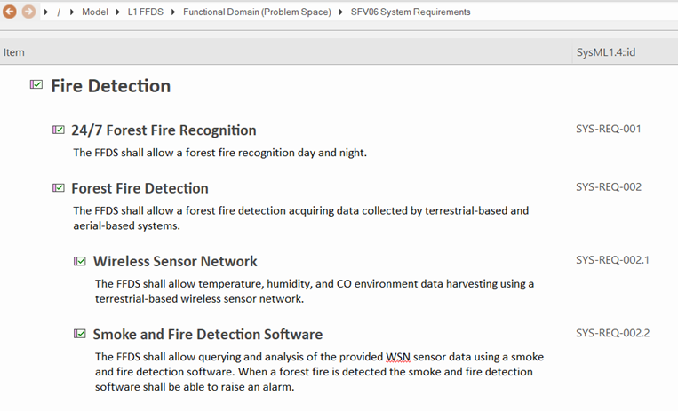

# SFV06a System Requirement VP

## Purpose
The System Requirement Viewpoint specifies functions, non-functional properties, or constraints of the System. System Requirements are captured, the interrelationships between Functional and Non-Functional Requirements on the same level of abstraction and the traceability to Stakeholder Requirements are depicted.

## Example

## Workflow
**Viewpoint Input:**
* SAF_StakeholderRequirement from [SOV06a](Stakeholder-Requirement-Viewpoint.md) as system requirement input source
* SAF_SystemCapability from [SFV02b](System-Capability-Viewpoint.md) as system requirement input source
* SAF_SystemFunction from [SFV03a](System-Process-Viewpoint.md) as system requirement input source
* ProxyPorts from [SFV01c](System-Context-Exchange-Viewpoint.md) as system requirement input source
* System States from [SFV03b](System-State-Viewpoint.md) as system requirement input source

**Step-by-Step Guide:**
1.	Open the global Specification Manager (and not the Specification View of a diagram).
2.	Select the dedicated package for System Requirements.
3.	Document or edit your identified requirements with the System Requirements stereotype.

**Viewpoint Output:**
* N/A

## Exposed Elements and Connectors
The following Stereotypes / Model Elements are used in the Viewpoint:
* [SAF_SystemRequirement](https://github.com/GfSE/SAF-Specification/blob/TdSE2023/stereotypes.md#SAF_SystemRequirement)
* [SAF_SystemFunctionalRequirement](https://github.com/GfSE/SAF-Specification/blob/TdSE2023/stereotypes.md#SAF_SystemFunctionalRequirement)
* [SAF_SystemNonFunctionalRequirement](https://github.com/GfSE/SAF-Specification/blob/TdSE2023/stereotypes.md#SAF_SystemNonFunctionalRequirement)
* [SAF_StakeholderRequirement](https://github.com/GfSE/SAF-Specification/blob/TdSE2023/stereotypes.md#SAF_StakeholderRequirement)
* [SAF_SystemFunctionalRequirementConstraint](https://github.com/GfSE/SAF-Specification/blob/TdSE2023/stereotypes.md#SAF_SystemFunctionalRequirementConstraint)
* [SAF_SystemRequirementDerivation](https://github.com/GfSE/SAF-Specification/blob/TdSE2023/stereotypes.md#SAF_SystemRequirementDerivation)

## General Recommendations and Pitfalls
* It has to be agreed whether the EA element "notes" or the SysML tagged value "text" is used to specify the system requirement.
* It is highly recommended to carefully analyze the regulatory QM requirements for the project in order to decide if the views in the Functional Domain have to be re-expressed and refined in formal System Requirements in this viewpoint.
* It is recommended to establish one single System Requirement view for one System of Interest.
* System requirements can be derived from the Operational Domain and in this case should be linked accordingly. However, they can also be derived from the analysis of the System of Interest (e.g., System Context, System State Machine or System Functional Breakdown) and thus no link to a stakeholder requirement can be created. These requirements should still be linked to their originating element/viewpoint, though.
* There is no automatic tool support to ensure that any subset of system requirements fully covers the stakeholder requirements or system analysis they are linked to. Thorough reviews are required to maintain this consistency.
* System requirements should be prioritized. These priorities should be aligned with the [SOV06a](Stakeholder-Requirement-Viewpoint.md) priorities.

[>>> back to cheat sheet overview](../CheatSheet.md)
