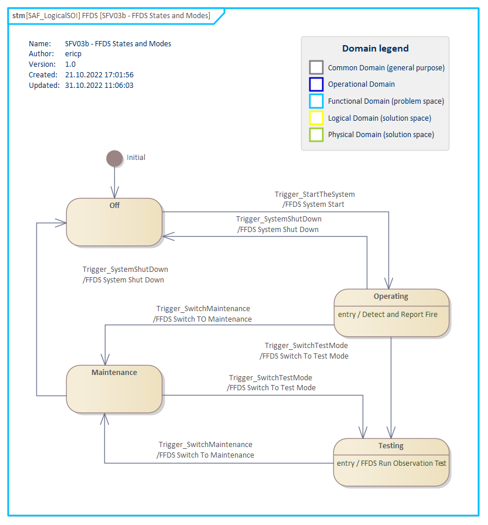

# SFV03b System State VP

## Purpose
The System State Viewpoint defines the conditions of the SOI or parts of thereof that constrain the execution of System Functions. System States are used as pre- or post-condition of System Use Cases, and as constraints within the definition of System Functions to specifying valid transitions. Valid transitions between System States and the conditions for transitioning are specified in system wide concepts captured in System Requirements.

## Example

## Workflow
**Viewpoint Input:**
* SAF_LogicalSOI from [SFV01b](System-Context-Definition-Viewpoint.md)
* caused trigger from [SFV03](System-Process-Viewpoint.md)

**Step-by-Step Guide:**
1.	Select a structural system element or a Domain Kind in the project browser which you want to describe behaviorally with a state machine.
2.	Create a new SAF System State Machine diagram as specialized [SysML 1.5 State Machine Diagram](https://sparxsystems.com/enterprise_architect_user_guide/16.1/modeling_languages/sysml_statemachine_diagram.html) below the element - right-click on the element, Add > Add Diagram > SAF > StateMachine > SAF::SFV03b_SystemStateMachineView.
3.	Describe the element’s behavior with states and transitions.
4.	If required, set a System Function as entry/execution/exit behavior in states on the state’s property page.

**Viewpoint Output:**
* State transitions can trigger System Process or System Functions in [SFV03](System-Process-Viewpoint.md)
* States and Modes are an input source for System Requirements in [SFV06a](System-Requirement-Viewpoint.md)

## Exposed Elements and Connectors
The following Stereotypes / Model Elements are used in the Viewpoint:
* Event
* State
* StateMachine
* Transition

## General Recommendations and Pitfalls
* While it is possible to define more than one System State Machine for one System of Interest, it has to be thoroughly ensured that these are exclusive and are not running at the same time.
*	System states and transitions that cannot be observed from outside the System of Interest should not appear in the System State Machine.
* In the problem space it is recommended to model separate reasons for a transition between two states as separate transitions instead of modelling one transition with multiple connected gates.
* A system’s safe state as a result of a safety concept should be considered in this viewpoint.

[>>> back to cheat sheet overview](../CheatSheet.md)
