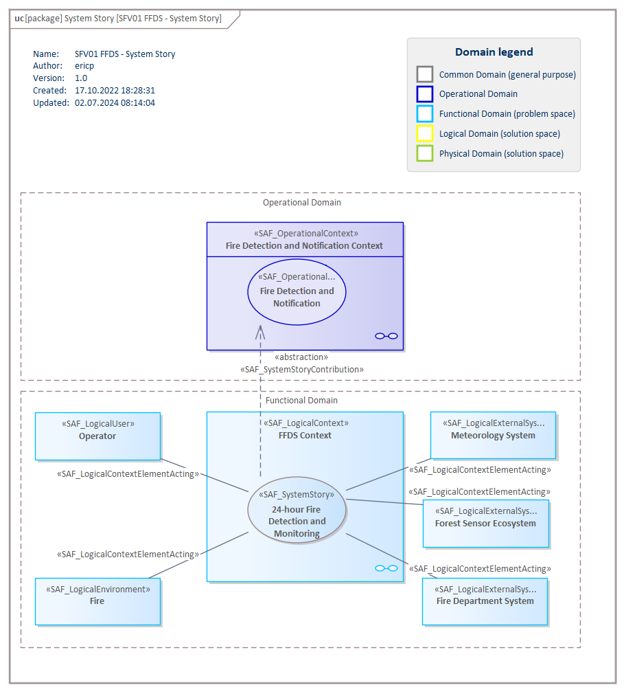

# SFV01a System Use Case VP

## Purpose
The System Use Case Viewpoint provides an outside view on the system functionality from the perspective of the system users and contributes to the definition of system requirements and system usage. The intended system use may be captured as free-text use case description, as well as storytelling approach on a coarse level of detail. The main system exchange partners participating in the intended system use are identified. System use cases are related to a specific system context.

## Example

## Workflow
**Viewpoint Input:**
* SAF_OperationalStory from [SOV01a](Operational-Story-Viewpoint.md) for the enabling System Use Cases
* SAF_LogicalContext from [SFV01b](System-Context-Definition.md) where a System Use Case is taking place
* SAF_Logical Context Elements from [SFV01b](System-Context-Definition.md)

**Step-by-Step Guide:**
1.  Create a System Use Case Diagram as specialized [SysML 1.5 Use Case Diagram](https://sparxsystems.com/enterprise_architect_user_guide/16.1/modeling_languages/sysml_use_cases.html) with Add Diagram > SAF > UseCase > SAF::SFV01a_SystemUSeCaseView.
2.	Drag and drop already created Logical Context Elements (e.g., a Logical User, Logical External System, or the Logical Environment) from their dedicated package onto the diagram who are involved in the system stories. In case additional Logical Context Elements are identified here, add the Logical Context Elements onto the diagram and move them to their dedicated package afterwards.
3.	Link System Use Cases with involved Logical Context Elements with the stereotype Logical Context Element Acting with the QuickLinker or the diagram’s toolbox.
4.	If needed, establish an include relationship between two System Stories Acting with the QuickLinker or the diagram’s toolbox.
5.	If needed, add existing Operational Stories to the diagram. Connect a System Use Case to these Operational Stories where it contributes to using the System Use Case Enabling stereotype.

**Viewpoint Output:**
* System Use Cases to be refined by SAF_SystemProcesses [SFV03a](System-Process-Viewpoint.md) or Interactions [SFV04a](System-Context-Interaction.md)
* System Use Cases are used to be mapped against System Capability in [SFV08a](System-Capability-Mapping-Viewpoint.md)
* System Use Cases as input source for system requirements [SFV06a](System-Requirement-Viewpoint.md) and system requirement traceability [SFV08b](System-Requirement-Traceability-Viewpoint.md) 

## Exposed Elements and Connectors
The following Stereotypes / Model Elements are used in the Viewpoint:
* Include [UML_Standard_Profile]
* [SAF_SystemUseCase](https://github.com/GfSE/SAF-Specification/blob/TdSE2023/stereotypes.md#SAF_SystemUseCase)
* [SAF_SystemUseCaseEnabling](https://github.com/GfSE/SAF-Specification/blob/TdSE2023/stereotypes.md#SAF_SystemUseCaseEnabling)
* [SAF_LogicalEnvironment](https://github.com/GfSE/SAF-Specification/blob/TdSE2023/stereotypes.md#SAF_LogicalEnvironment)
* [SAF_LogicalExternalSystem](https://github.com/GfSE/SAF-Specification/blob/TdSE2023/stereotypes.md#SAF_LogicalExternalSystem)
* [SAF_LogicalUser](https://github.com/GfSE/SAF-Specification/blob/TdSE2023/stereotypes.md#SAF_LogicalUser)
* [SAF_LogicalContextElementActing](https://github.com/GfSE/SAF-Specification/blob/TdSE2023/stereotypes.md#SAF_LogicalContextElementActing)
* [SAF_LogicalContext](https://github.com/GfSE/SAF-Specification/blob/TdSE2023/stereotypes.md#SAF_LogicalContext)
* Attribute "subject" of UseCase referencing SAF_LogicalContext
  
## General Recommendations and Pitfalls
* While the System Story is more specific than the Operational Story, it is still a black box description and should reside in the problem space. It should be avoided to go into technical details and solutions, but rather keep an outside perspective.
* In the likely event that the System Story cannot fully cover an Operational Story it contributes to, the System Stories of the other contributing Systems do not need to be modeled. They are represented through the linked Logical Context Elements.

[>>> back to cheat sheet overview](../CheatSheet.md)
